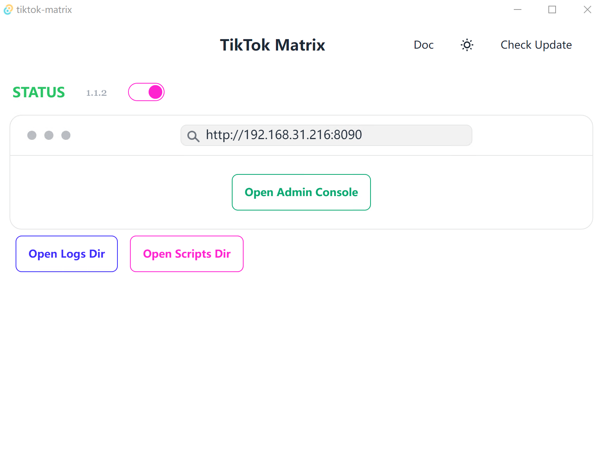

# Tutorial Intro

Let's discover **TikTok Matrix in less than 5 minutes**.

## Getting Started

Get started by **run an auto train job**.
and **run an auto publish job**.
<iframe width="560" height="315" src="https://www.youtube.com/embed/q7HhePYNUx0?si=ortlbW3cdcEBR5fY" title="YouTube video player" frameborder="0" allow="accelerometer; autoplay; clipboard-write; encrypted-media; gyroscope; picture-in-picture; web-share" referrerpolicy="strict-origin-when-cross-origin" allowfullscreen></iframe>

### What you'll need

- Android Device
  - The Android device requires at least API 21 (Android 5.0).
  - Make sure you enabled USB debugging on your device(s).
  - On some devices, you also need to enable an additional option USB debugging (Security Settings) (this is an item different from USB debugging) to control it using a keyboard and mouse. Rebooting the device is necessary once this option is set.

- Windows PC
  - Windows 7 or later
- USB Cable or TCP/IP connection

## Installation

Download the latest version of TikTok Matrix from the [GitHub Releases](https://github.com/niostack/tiktok-matrix/releases) page.

## Start

1. Click the `Open Admin Console` button to open the admin console.

