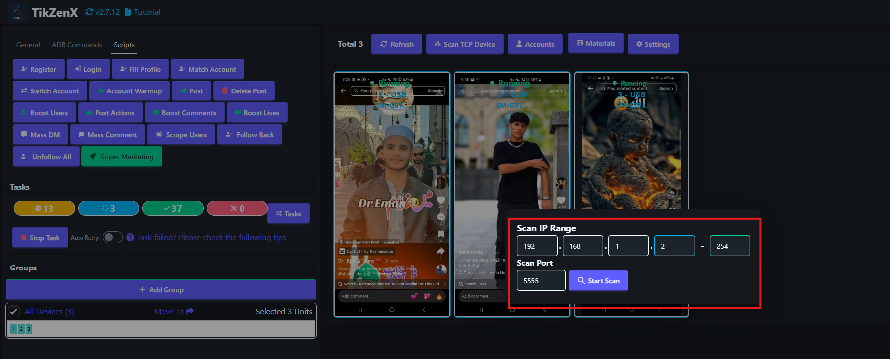
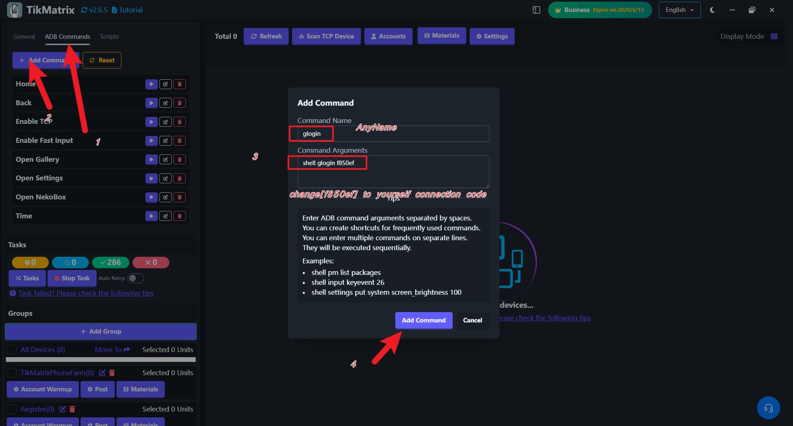

# Connect to CloudPhone

This guide will help you connect to a GeeLark CloudPhone using TikMatrix.

You can purchase a CloudPhone from [GeeLark](https://www.geelark.cn?invite_code=XHY6a8).

## Enable ADB

Enable ADB in the desired CloudPhone profile from the Profiles section.


You can also enable ADB for multiple profiles at once.


## Start the Profile

After opening the profile, click the 🔗 icon to get the IP address, port, and connection code for the CloudPhone.


## Scan TCP Devices

Click the `Scan Tcp Devices` button in the top toolbar. Enter the IP address and port you obtained from the profile.


> If successful, TikMatrix will display: "1 device found. Please wait..."
The phone will appear in TikMatrix shortly after the scan. If it doesn't, double-check the IP address, port, and ensure the CloudPhone is powered on.

## Authenticate Connection

GeeLark CloudPhone requires authentication. Click `ADB Commands` > `Add Command` to create a new command with the following:

```bash
# Replace `f850ef` with the connection code from the profile.
shell glogin f850ef
```



## Final Steps

Select the device and run the command to authenticate the connection.

Congratulations! You are now connected to your CloudPhone and can manage it like any other Android device in TikMatrix.
