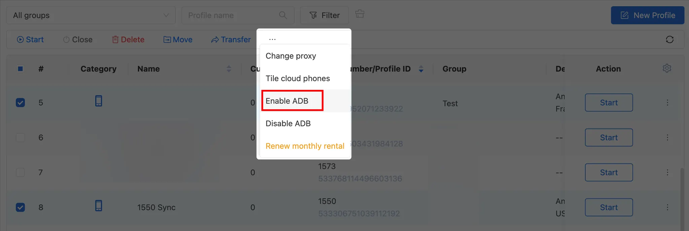

# Connect to CloudPhone

This guide will help you connect to a GeeLark CloudPhone using TikMatrix.

:::warning Network Recommendation
Please ensure your computer and the CloudPhone data center have sufficient, stable network bandwidth. For best reliability of automated tasks, it's recommended that your computer and the cloud phone's data center are located in the same country or region to reduce latency and packet loss.
:::

You can purchase a CloudPhone from [GeeLark](https://www.geelark.cn?invite_code=XHY6a8).

## Enable ADB

Enable ADB in the desired CloudPhone profile from the Profiles section.


You can also enable ADB for multiple profiles at once.


## Start the Profile

After opening the profile, click the 🔗 icon to get the IP address, port, and connection code for the CloudPhone.


## Method 1: Quick Connect with Cloud Phone List (Recommended)

TikMatrix now supports saving cloud phone connection information for quick one-click connection.

### Save Cloud Phone Information

1. Open TikMatrix and click the `Scan TCP Devices` button.
2. Switch to the `Cloud Phone List` tab.
3. Click the `Add` button.
4. Fill in the cloud phone information:
   - **Name**: A friendly name to identify your cloud phone (e.g., "GeeLark Phone 1")
   - **IP Address**: The IP address from GeeLark (e.g., `1.2.3.4`)
   - **Port**: The port number (default: `5555`)
   - **Auth Code**: The connection code from GeeLark (e.g., `f850ef`)
5. Click `Save`.

### Connect to Cloud Phone

Once saved, you can connect in two ways:

**Single Connection:**

- Click the 🔌 button next to any cloud phone in the list.

**Batch Connection:**

- Select multiple cloud phones using the checkboxes.
- Click the `Connect (X)` button at the top.

The system will automatically:

1. Connect via ADB
2. Execute the glogin authentication command
3. Show connection results

After successful connection, refresh the device list to see your cloud phones.

## Method 2: Manual Connection via ADB Terminal

If you prefer manual connection or need to troubleshoot:

### Run ADB Commands

1. Click `Settings` > `Open ADB Terminal` in TikMatrix.
2. Run the connection command based on your operating system and check if your phone appears in the list with status `device`.
3. Run the authentication command to authenticate the connection.

### For Windows systems

```shell
.\adb.exe connect <IP_ADDRESS>:<PORT>
.\adb.exe -s <IP_ADDRESS>:<PORT> shell glogin <CONNECTION_CODE>
```

### For Mac/Linux systems

```shell
./adb connect <IP_ADDRESS>:<PORT>
./adb -s <IP_ADDRESS>:<PORT> shell glogin <CONNECTION_CODE>
```

> For example, if your IP address is `1.2.3.4` and your port is `5555` and the connection code is `f850ef`
>
> **Windows:**
>
> ```shell
> .\adb.exe connect 1.2.3.4:5555
> .\adb.exe -s 1.2.3.4:5555 shell glogin f850ef
> ```
>
> **Mac/Linux:**
>
> ```shell
> ./adb connect 1.2.3.4:5555
> ./adb -s 1.2.3.4:5555 shell glogin f850ef
> ```

## Tips

- Save all your cloud phones in the list for quick access.
- The connection status is displayed next to each cloud phone.
- You can edit or delete saved cloud phones at any time.
- Connection information is stored locally on your computer.

## Final Steps

Open TikMatrix and wait for the CloudPhone to appear in the device list. If it doesn't show up immediately, try refreshing the device list.

Congratulations! You are now connected to your CloudPhone and can manage it like any other Android device in TikMatrix.
