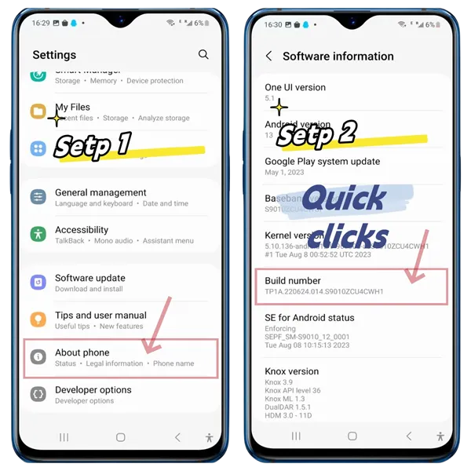
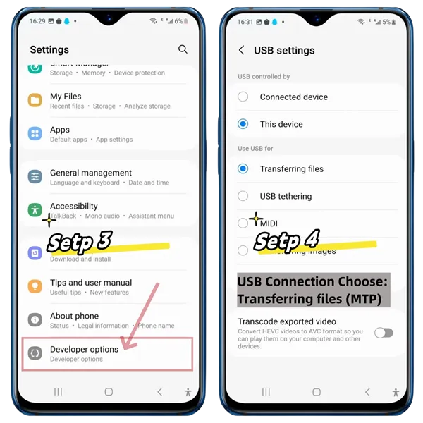
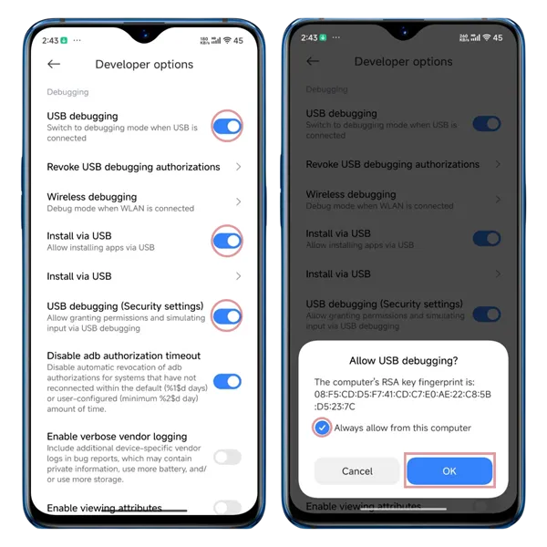
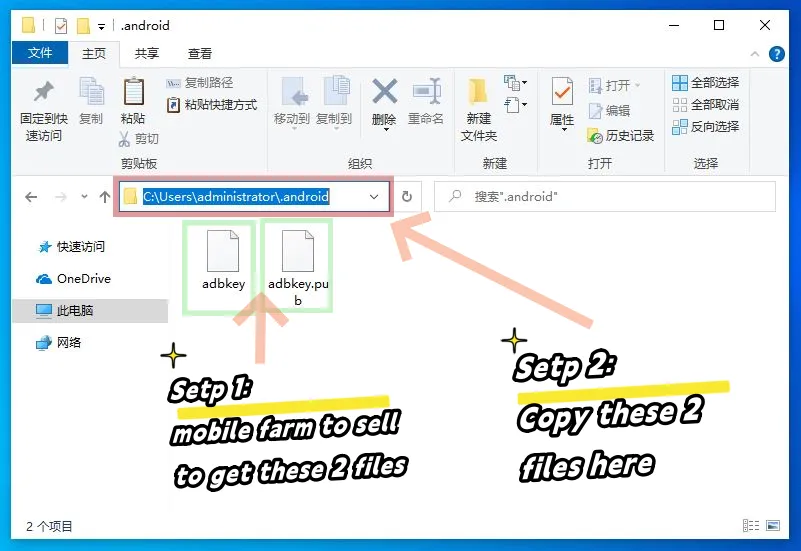

# Connect to Devices

TikMatrix supports both USB and TCP connections for Android devices.

## USB Connection

1. Open your phone's developer settings and enable USB debugging (see screenshots below).
   - **For Xiaomi phones**: You must also enable "Install via USB" and "USB debugging (Security Settings)" options in the developer settings.
2. Connect your phone to the computer via USB.
3. When prompted on your phone, tap `Allow` to enable USB debugging.
4. Wait for the connection to be established.

## TCP Connection

1. Connect your phone to the computer via USB.
2. In TikMatrix, click `ADB Commands` > `Enable TCP` to enable TCP/IP connection.
3. Disconnect the USB cable (or switch to OTG mode if using a phone box).
4. Click the `Scan Tcp Devices` button and enter the IP range (you can find this in your router's admin page).
5. Click `Scan` to search for devices in the specified IP range.
6. Wait for the connection to be established.

**For Cloud Phones**: TikMatrix now supports saving cloud phone connections for quick access. Switch to the `Cloud Phone List` tab in the scan dialog to save and manage your cloud phone connections. See the [Connect to CloudPhone](./1.connect-to-cloudphone.md) guide for detailed instructions.

## Screenshots

### Tips

- The procedure may vary by brand, but the general steps are similar.
- If there is no response, try a different data cable or use a USB port on the back of your computer.

## How to Connect a Motherboard or Case

1. Request the authorization files `adbkey` and `adbkey.pub` from your motherboard or case seller.
2. Copy these files to `C:\Users\YourComputerUsername\.android` on your computer.
3. Restart your computer.

## Screenshot

### Additional Tips

- Back up your authorization files. If you reinstall your system or switch computers, you'll need them again.
- If these files are lost, you'll need to manually allow permission on the phone screen.

## How to Connect More USB Devices

💡 USB supports up to 127 devices — in theory.  
But in practice, most consumer motherboards limit it to around 40 devices due to firmware and chipset constraints.

🖥️ Server-grade motherboards (e.g., X79 architecture) are different — they typically remove these USB limits, allowing you to scale massively.

🔧 How to connect more devices successfully:

1. Use the USB ports on the back of the PC — they are wired more directly to the motherboard.  
2. Use USB 2.0 ports (usually black), not USB 3.0 (blue), which can be unstable for large farms.  
3. In BIOS Settings:  
   - Disable XHCI  
   - Enable EHCI

These steps will help your system recognize more devices reliably.
