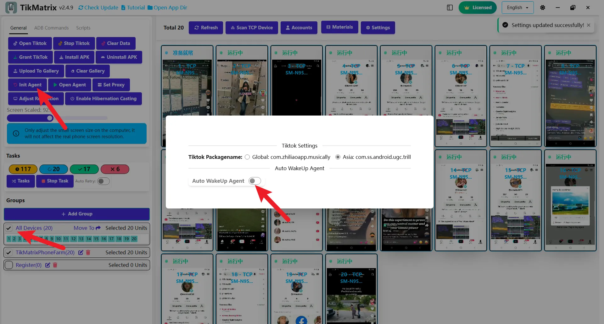

# Initialize Devices

:::warning
This application is installed via Android's official ADB debugging channel for device automation control. Some devices may prompt whether to send an unknown app sample to Google; this is an Android system security prompt unrelated to app safety and does not affect normal use. Click "Don't send" to complete the installation.
:::

The TikMatrix APK is a mobile agent required for automation tasks. **When you connect your phone to TikMatrix for the first time, the system will automatically initialize your device and install the TikMatrix app** - no manual intervention is required.

During the automatic initialization process, TikMatrix will install two APK files: TikMatrix and TikMatrix Test (no interface). If your phone prompts for installation authorization, simply tap "Allow" (especially important on Xiaomi devices).

## Automatic vs Manual Installation

**Automatic Installation (Recommended)**: By default, TikMatrix automatically initializes devices when they are first connected. This is the easiest and most convenient method.

**Manual Installation/Update**: Only needed in special cases or for updates.

## Automatic Initialization Process

When you connect a new device to TikMatrix:

1. **Device Detection**: TikMatrix automatically detects the connected device.
2. **Automatic Installation**: The system will automatically install the TikMatrix app without user intervention.
3. **Authorization**: If your device prompts for installation permission, simply tap "Allow".
4. **Completion**: The initialization process completes in about 10 seconds.
5. **Ready to Use**: Your device is now ready for automation tasks.

This automatic process eliminates the need for manual setup in most cases.

## Manual Installation/Update

To manually install or update the TikMatrix APK, turn off the `Auto WakeUP Agent` switch in Settings. Then follow these steps:

1. Select your phone and click `General` > `Init Agent`.
2. TikMatrix will automatically install both APK files on your phone.
3. If prompted, tap "Allow" to authorize installation.
4. If blocked by Google Play Protect, tap "Install anyway" to continue.
5. Wait for installation to complete (about 10 seconds).
6. Turn on the `Auto WakeUP Agent` switch to enable automatic app wake-up when the phone is connected.
7. Click `General` > `Open Agent` to test the installation. If the app fails to start, contact technical support.

## Screenshot

