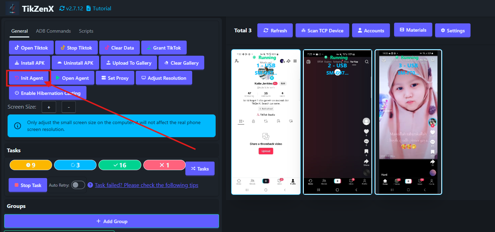

# Initialize Devices

The TikMatrix APK is a mobile agent required for automation tasks. When you connect your phone to the computer for the first time, TikMatrix will automatically install two APK files: TikMatrix and TikMatrix Test (no interface). If your phone prompts for installation authorization, please tap "Allow" (especially on Xiaomi devices).

## Manual Installation/Update

To manually install or update the TikMatrix APK, turn off the `Auto WakeUP Agent` switch in Settings. Then follow these steps:

1. Select your phone and click `General` > `Init Agent`.
2. TikMatrix will automatically install both APK files on your phone.
3. If prompted, tap "Allow" to authorize installation.
4. If blocked by Google Play Protect, tap "Install anyway" to continue.
5. Wait for installation to complete (about 10 seconds).
6. Turn on the `Auto WakeUP Agent` switch to enable automatic app wake-up when the phone is connected.
7. Click `General` > `Open Agent` to test the installation. If the app fails to start, contact technical support.

## Screenshot

