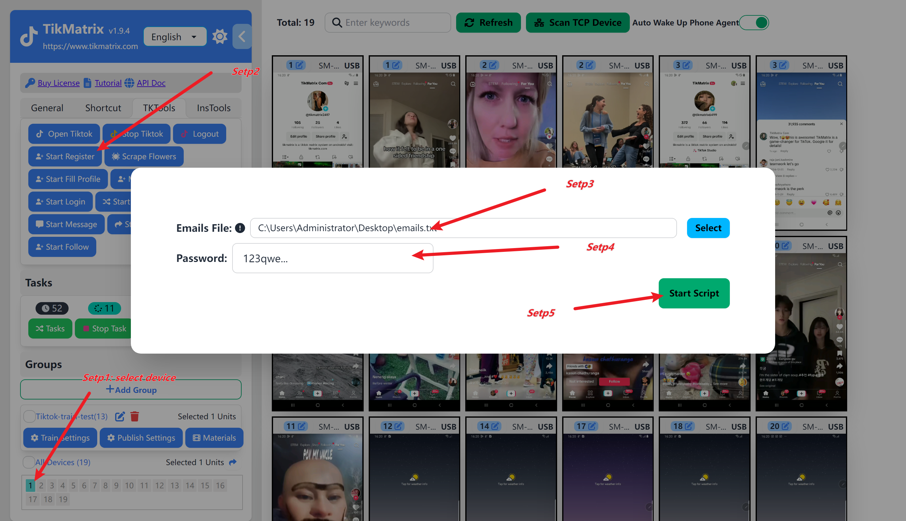

# Bind Account

Add TikTok accounts in the TikMatrix software. Only devices with added accounts can perform specific functions; otherwise, no tasks will be created.

## 1.Accounts Registered and Logged In(Recommended for Beginners)

1. Manually log in to the account on the phone.
2. Select devices.
3. Click the `Tk Toolbox` - `Match Account` button.
4. The system will automatically recognize the accounts logged in on the device and add them to the account list.

## Accounts Registered but Not Logged In(Premium Users Only)

1. Click the `General` - `Account` - `Add` button on the left sidebar.
2. Enter the email (optional), password (optional), and username (required, must start with `@`).
3. Select a device to log in to the account.
4. Click the `Add` button to save.
5. Select a device and click the `Tk Toolbox` - `Start Login` button.
6. The system will automatically log in the accounts that are not yet logged in on the device. If email verification or CAPTCHA is required, please handle it manually.

## Register New Account(Premium Users Only)

1. Select one or more devices to perform the Register task.
2. Click `TK Toolbox`, then click the `Start Register` button.
3. Enter the registration email (one per line) and the registration password.
4. Click the `Start Script` button to begin the Register task.
5. The Register task will start, and the accounts will be added to the devices once the task is completed.

## Screenshot

