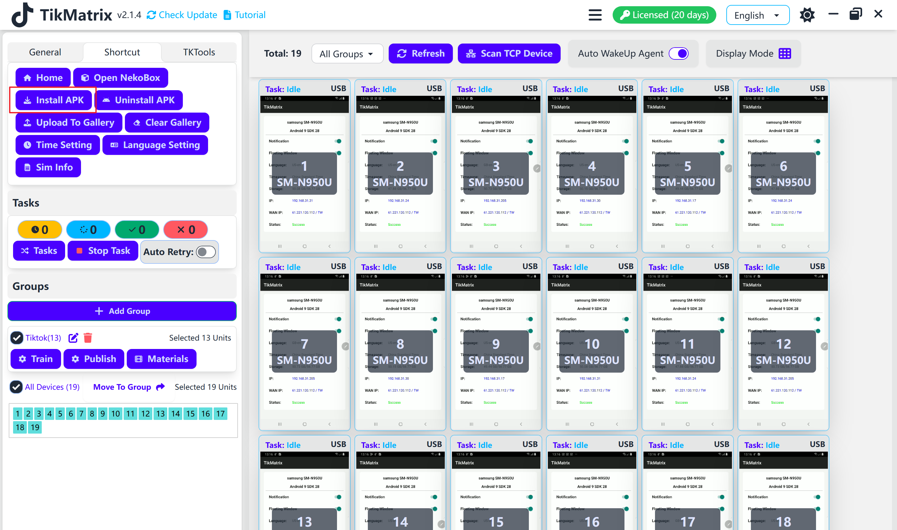

# Install TikTok

We recommend downloading the specified version below, as newer versions may not be compatible. The software will be updated periodically, and supported versions will be announced in the group after updates.

## Download Tiktok apk

* Global Version: [com.zhiliaoapp.musically](https://apkpure.com/tiktok-musically-2024/com.zhiliaoapp.musically)
* Asian Version: [com.ss.android.ugc.trill](https://apkpure.com/tiktok/com.ss.android.ugc.trill)

## Installation Steps

1. Download the APK installation package from the above links.
2. Select all devices.
3. Click `General` - `Install APK` - Choose the downloaded APK package.
4. Wait for the installation to complete (it may take 1-3 minutes per device depending on the phone model; please be patient and do not click the "Install APK" button repeatedly).
5. After installation, you need to click `Settings` button and check if the TikTok version is matched with the version of your installed TikTok.

## Screenshots

