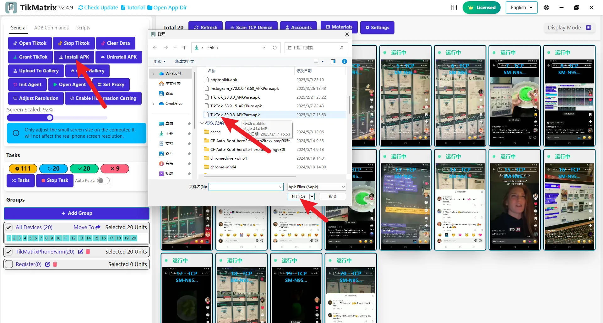

# Install TikTok

We recommend downloading the specific TikTok versions below, as newer versions may not be compatible. Supported versions will be announced in the group after updates.

## Download TikTok APK

- Global Version: [com.zhiliaoapp.musically](https://apkpure.com/tiktok-musically-2024/com.zhiliaoapp.musically)
- Asian Version: [com.ss.android.ugc.trill](https://apkpure.com/tiktok/com.ss.android.ugc.trill)

## Installation Steps

1. Download the APK from the links above.
2. Select all devices in TikMatrix.
3. Click `General` > `Install APK` and choose the downloaded APK file.
4. Wait for installation to complete (may take 1-3 minutes per device depending on model; do not click repeatedly).
5. After installation, click `Settings` and verify the TikTok version matches your installed app.
6. Click `Open TikTok` to check if the app is installed correctly.
7. Ensure TikTok's language is set to English; otherwise, scripts may not work properly. Change the language in TikTok settings if needed.

## Screenshot

