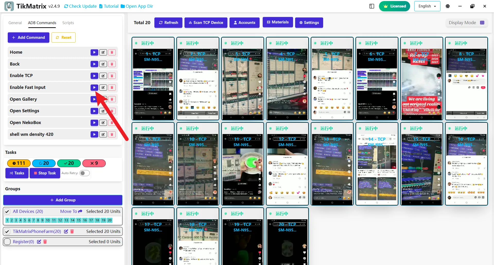

# Enable Fast Input Keyboard

When your phone is connected, TikMatrix will automatically switch to the Fast Input keyboard.

## Why Use the Fast Input Keyboard?

The Fast Input keyboard is essential for TikMatrix, providing automatic multilingual support. Without it, text input features such as commenting, messaging, and publishing titles may not work correctly.

## How to Manually Enable the Fast Input Keyboard

1. Select the device you want to use.
2. Click `ADB Commands` > `Enable Fast Input`.

## How to Input Text

You can input text in TikMatrix using multiple methods:

### Method 1: Direct Keyboard Input ⌨️ (New Feature)

⭐ **Keyboard Input Control** - You can now type directly on your phones using your computer keyboard, making text input faster and more convenient.

1. Select the device you want to use.
2. Click on any text field on the phone screen.
3. Start typing directly on your computer keyboard - the text will appear on your phone in real-time.

### Method 2: Input Panel

1. Click on the phone screen to expand it, then click the `Input` button in the right toolbar.
2. Enter your text in the input box and click send.

## Copy and Paste Between Phone and Computer

### Copy Phone Clipboard to Computer

1. Select the phone, hold `Ctrl+C` to copy the phone's clipboard to your computer.

### Paste Computer Clipboard to Phone

1. Select the device, hold `Ctrl+V` to paste your computer's clipboard into the phone's input box.

## Screenshot

