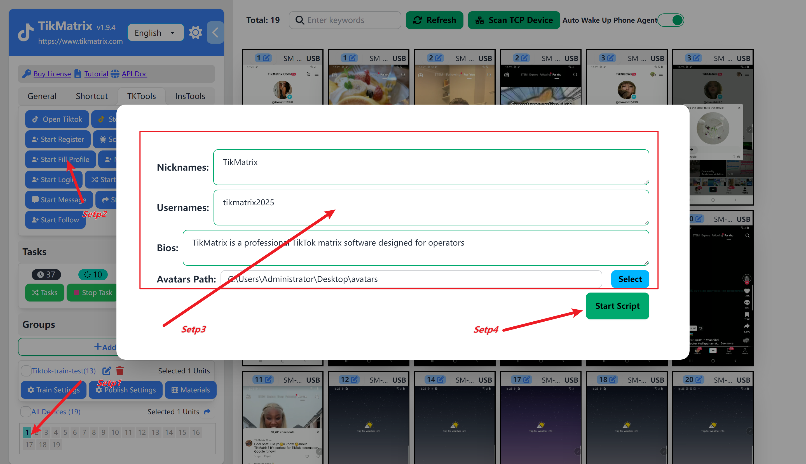

# Set Up Profile

It's best to **set up your profile** within 1-2 days after registration.

## Steps

1. Select one or more devices to execute the profile setup task.
2. Click `TK Toolbox`, then click the `Start Fill Profile` button.
3. Input the profile information, such as `Nickname`, `Username`, `Bio`, and `Avatar`.
4. Click the `Start Script` button to begin the profile setup task.
5. The task will start immediately, and the username in the account list will be updated upon completion.

## Screenshot

