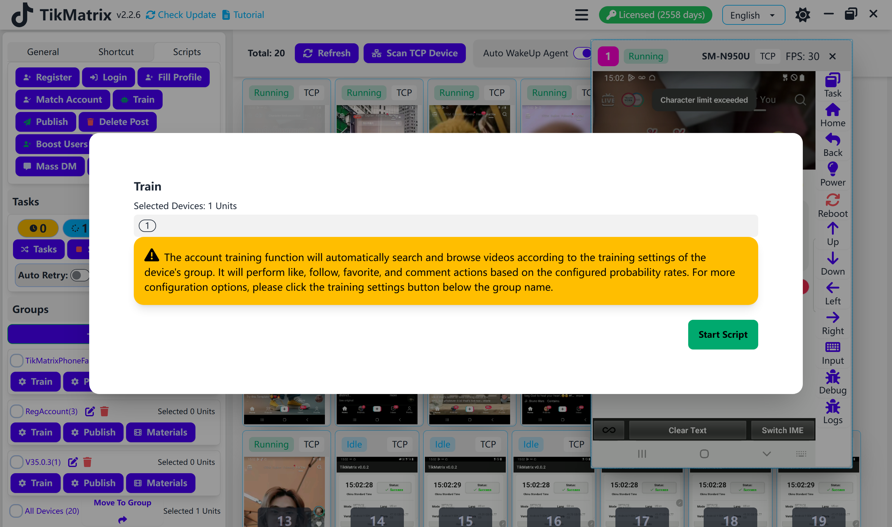
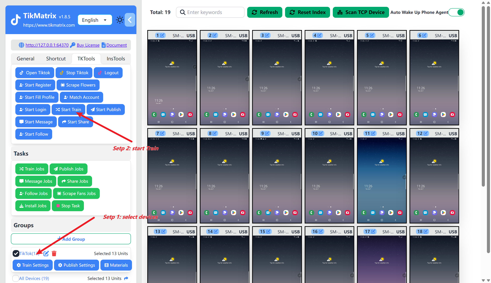

# Auto Training

Account training tasks automatically perform actions such as searching keywords, watching videos, following, liking, commenting, and collecting within a specified period.

## Setting up a Training Task

Before create a training task, you need to complete [Create a Group](create-a-group) and [Bind an Account](create-a-account), otherwise, it will prompt that 0 tasks have been created.

1. Click `Train Settings` of the `Group` you want to train.
2. Enable the `Auto Training` switch if you want to automatically start the training task.
3. Fill the start time(PC time) for the training task (`Hour:Minute`).
4. Fill the keywords if you want to search for.
5. Set the probabilities for following, liking, commenting, and collecting.
6. Fill the comment content if you want to comment.
7. Click the `Save` button.

## Start Task

### Manual Start

Select one or more devices to start the training task, click `TK Toolbox`, and then click the `Start Training` button. The task will be created and started within one minute.

### Automatic Start

Turn on the auto training switch and set the start time for the training task. The task will be automatically created and started.

## Screenshots

## Video

<video src="https://r2.tikmatrix.com/train-0508.mp4" controls width="400" height="300"></video>

## Note

- If the set time is in the past, the training task will not start today.
- If the set time is in the future, the training task will be created within one minute and start at the set time.
- If multiple times are set, multiple training tasks will be created each day. The maximum number of training tasks is 6.
