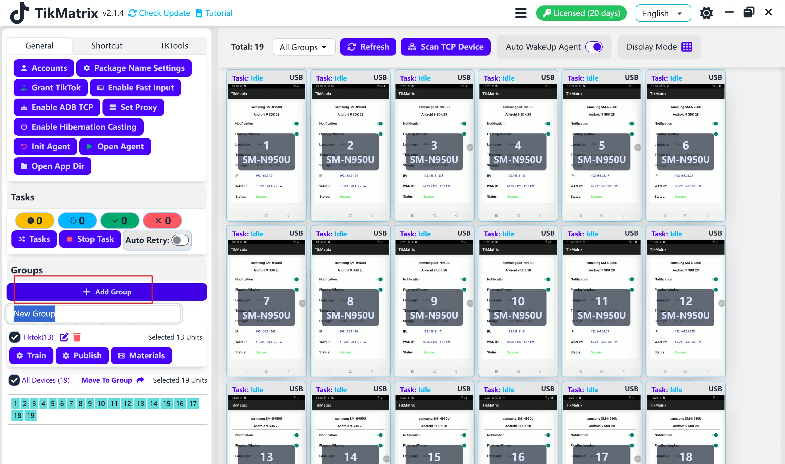

# Create Group

A **Group** is a collection of devices, making it easier to manage and operate multiple devices together.

## How to Create a Group

1. Click the `Add Group` button in the left sidebar.
2. Enter a group name.
3. Press `Enter` to save the group.
4. Select devices to move them into the group.

## Screenshot

