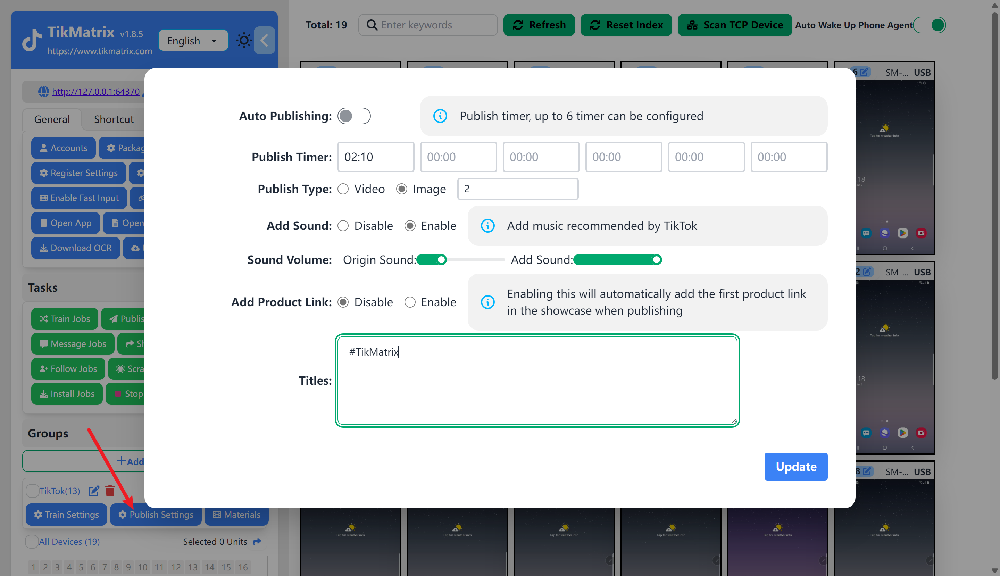
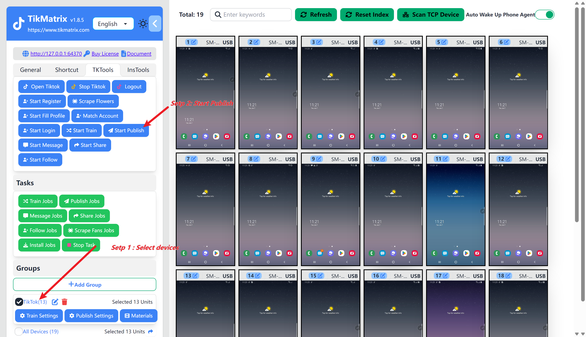

# Auto Posting

Auto Posting is a feature that allows you to automatically post videos or images to TikTok at a specific time. You can set the caption, tags, and video/image with recommended sound and product link for the post.

## Setting up a Posting Job

Before creating a posting task, you need to complete [Create Group](create-a-group) and [Bind Account](create-a-account), otherwise, it will prompt that 0 tasks have been created.

1. Click the `Publish Settings` button of the group.
2. If you want to post a video at a specific time, turn on the `Auto Publishing` switch, configure the time to start the posting task (`hour:minute`), this time is the time of the computer. (Not recommended to enable this feature for the first test)
3. Select the type of post, support video and image (you can set the number of images).
4. Choose whether to add TikTok recommended music (you can customize the volume of the original sound and recommended music).
5. Choose whether to add a product link. (If enabled, the first product link in the storefront will be automatically added when posting the video)
6. Fill in the title and tags. The format is `Title#Tag1#Tag2#Tag3`.
7. Click the `Save` button.
8. Click the `Materials` button to upload videos or images. If you want to set a separate title and tags for each material, click the `Edit Title` button of the material.

## Screenshot

## Starting a Posting Job

Before starting a posting task, you need to bind and log in to the account for the device.

### Manually Start

Select one or more devices that need to start the posting task, click the `TK Toolbox` and then click the `Start Posting` button. The task will be created and started within 1 minute.

### Automatically Start

Turn on the auto posting switch and set the time to start the posting task. The task will be created and started automatically.

<video src="https://r2.tikmatrix.com/post-0510.mp4" controls width="400" height="300"></video>

## Note

* If the set time is in the past, the posting task will not start today.
* If the set time is in the future, the posting task will be created within one minute and start at the time you set.
* If multiple times are set, multiple posting jobs will be created every day. The maximum number of posting jobs is 6.
