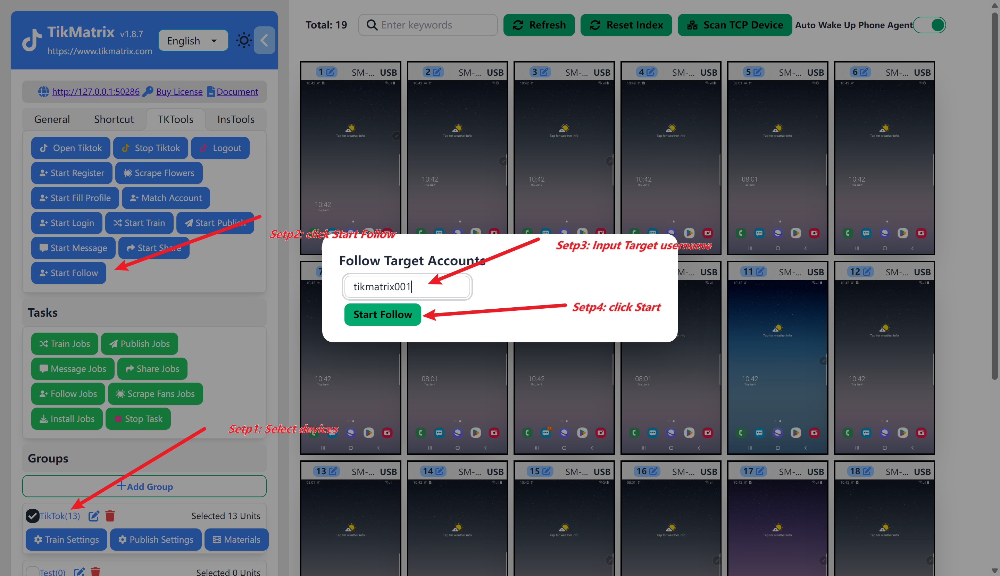

# Batch Follow&Unfollow&Followers

Control the TikTok account to perform batch follow&unfollow&followers operations on a single target user.

## Steps

1. Select one or more devices for following.
2. Click `Tk Toolbox` in the left sidebar, then click the `Follow&Unfollow&Followers` button.
3. Enter the TikTok username you want to follow, for example: `tikmatrix001`.
4. Once the task is successfully created, the automatic following will start within one minute.

## Screenshot

