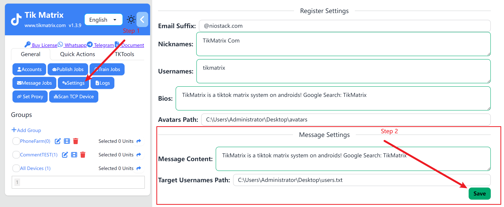
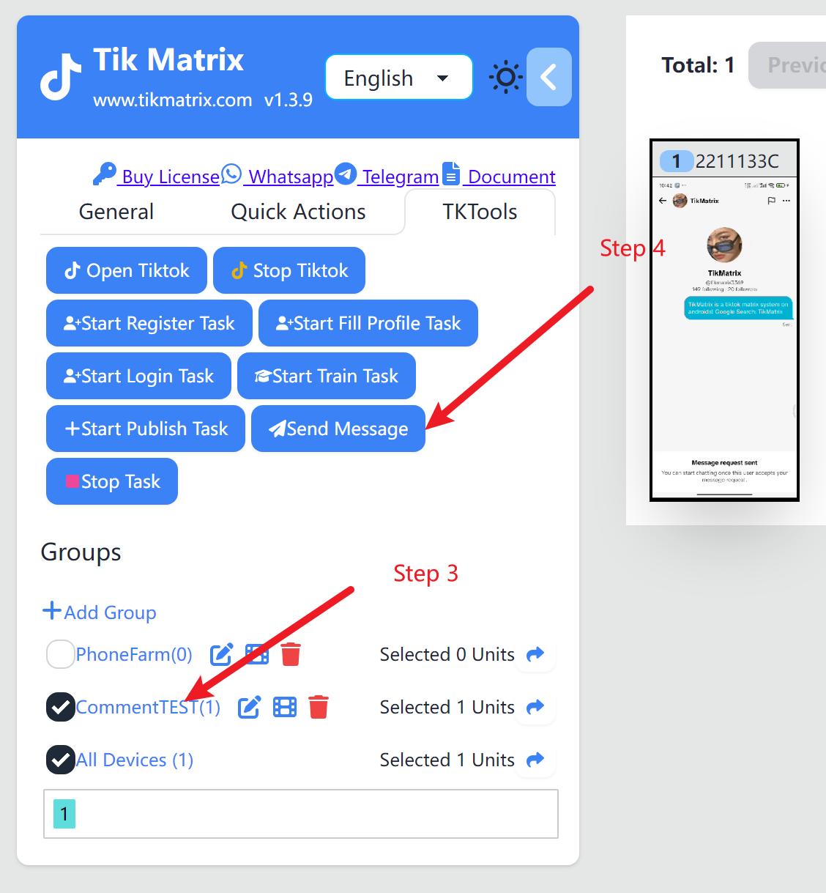
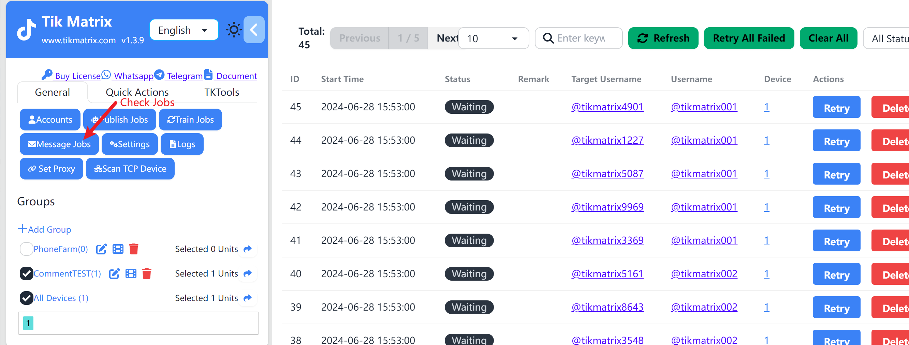

# Create Messaging Task

Messaging tasks are used to automatically send direct messages to target users.

## Steps

1. Click `General`- `Message Settings` button.
2. Enter the content of the private message.
3. Click the `Select` button and choose the file path of the target username text file where the private message will be sent.
4. Select one or more devices for sending the private message.
5. Click `Tk Toolbox` in the left sidebar, then click the `Send Message` button.
6. Click `Tasks` in the left sidebar, then click the `Message Tasks` button to view the task list.
7. Once the private message task is successfully created, the automatic sending of private messages will start within one minute.

## Screenshot

## Notes

- Multiple message contents can be configured, one per line. Each task will randomly use one content.
- The txt file for target users should contain TikTok usernames, one per line.
- When selecting multiple devices, the direct messaging tasks will be evenly distributed.
