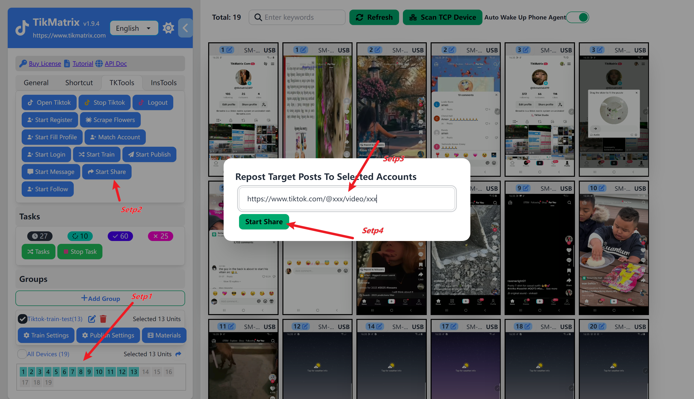

# Like&Comment&Share&Favorite&View

Like&Comment&Share&Favorite&View is a feature that allows you to automatically like, comment, share, favorite, and view TikTok videos.

## Steps

Before creating a Like&Comment&Share&Favorite&View task, you need to complete [Bind Account](create-a-account), otherwise, it will prompt that 0 tasks have been created.

1. Select the devices that need to perform the task.
2. Click on `Tk Toolbox` - `Like&Comment&Share&Favorite&View`.
3. Enter the TikTok video link in the format `https://www.tiktok.com/@xxx/video/xxx`. You can copy the video link from the browser's address bar on the TikTok website.
4. Once the task is successfully created, the automatic like, comment, share, favorite, and view will start within one minute.

## Screenshot

