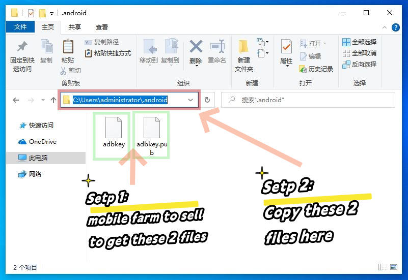

# Connect to Devices

Support USB and TCP connection now.

## Steps

1. Open the developer settings of the phone - USB debugging switch (refer to the screenshot below)
2. Connect the phone to the computer via USB. USB connection is the default connection method. Please wait for 10 seconds.
3. If you need an OTG (TCP) connection, click the `Scan Tcp Devices` button. Please wait for 10 seconds.

## Screenshots

### Tips

* The procedure may vary from brand to brand, but basically it's pretty much the same.
* If there is no response, please try to replace the data cable or the USB port behind the computer.

## How to Connect the Motherboard or Case

1. Request the authorization files `adbkey` and `adbkey.pub` from the seller of your motherboard or case.
2. Copy the authorization files to the `C:\Users\YourComputerUsername\.android` directory on your computer.
3. Restart your computer.

## Screenshots2

### Tip 2

* Please make sure to back up these two authorization files properly, as you will need them again if you reinstall the system or switch to a new computer.
* If these two files are lost, you will need to touch the phone screen to allow permission.
