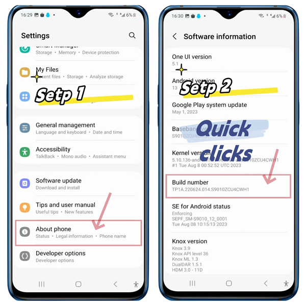
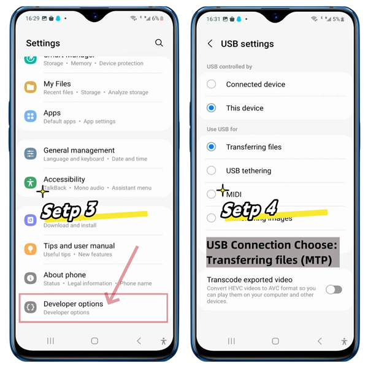
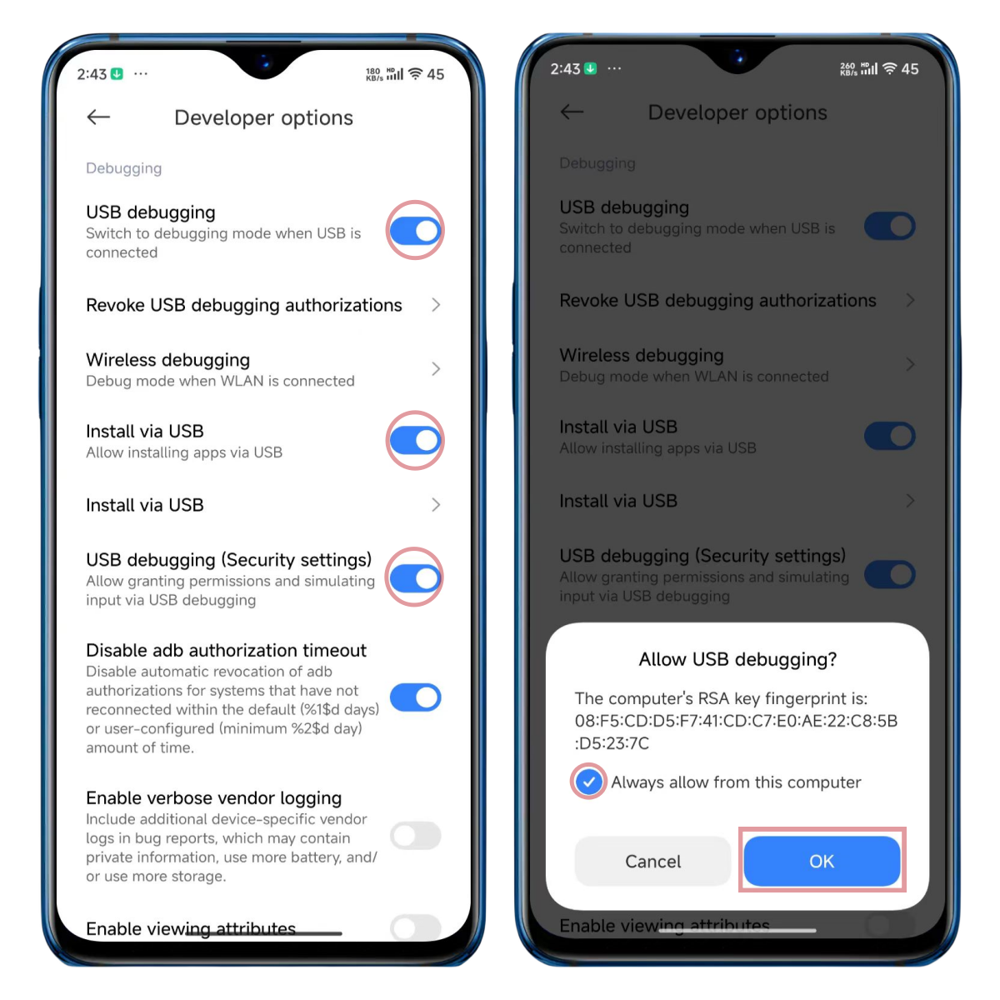

# Connect to Devices

Support USB and TCP connection now.

## Steps

1. Open the developer settings of the phone - USB debugging switch (refer to the screenshot below)
2. Connect the phone to the computer via USB. USB connection is the default connection method. Please wait for 10 seconds.
3. If you need an OTG (TCP) connection, click the `Scan Tcp Devices` button. Please wait for 10 seconds.

## Screenshots

### Tips

* The procedure may vary from brand to brand, but basically it's pretty much the same.
* If there is no response, please try to replace the data cable or the USB port behind the computer.
