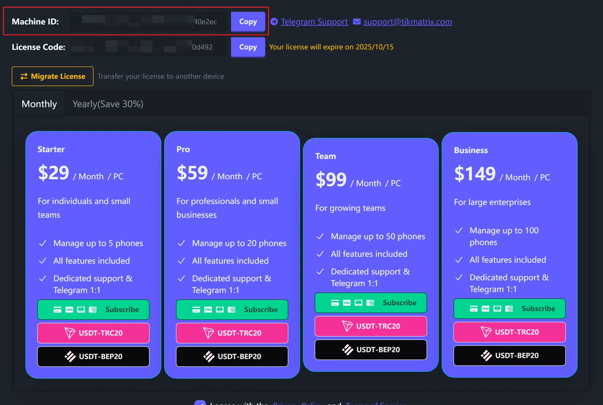

# License Migration

Transfer your TikMatrix license from one computer to another. This is useful when upgrading hardware or switching computers.

## Requirements

- Active license on current computer (activation code or Stripe subscription)
- Target computer without existing TikMatrix license
- Maximum 5 migrations per month allowed

## Migration Steps

### Step 1: Open Migration Dialog

1. Launch TikMatrix on your current computer
2. Click the **License icon** in the title bar
3. Click the **"Migrate License"** button

### Step 2: Get Target Machine ID

On your target computer:

1. Install and launch TikMatrix
2. Click the **License icon** in the title bar
3. Copy the **Machine ID**
4. Send this ID to your current computer

### Step 3: Validate and Migrate

Back on your current computer:

1. Paste the **Target Machine ID** in the migration dialog
2. Click **"Validate"** to check compatibility
3. Review the license details shown

1. Check the confirmation checkbox
2. Click **"Migrate License"** and confirm

### Step 4: Complete Setup

1. Wait for migration to complete
2. On your target computer, restart TikMatrix
3. Your license is now active on the new computer

## Important Warnings

⚠️ **License migration cannot be undone**

- The license moves completely from source to target
- Your old computer loses access immediately
- Maximum 5 migrations per month
- Both computers need stable internet

## What Gets Migrated

### For Activation Codes

- License status and remaining days
- License code information

### For Stripe Subscriptions

- Subscription status and billing info
- Renewal dates and plan details

## Troubleshooting

### Common Error Messages

#### "Target machine already has a license"

The target computer already has an active license. Migration only works to computers without existing licenses.

#### "Monthly migration limit exceeded"

You can only migrate 5 times per month. Wait until next month or contact support.

#### "Invalid machine ID format"

Ensure you copied the complete Machine ID correctly. It should be at least 10 characters long.

#### "Migration validation failed"

Check that:

- Your current license is active and not expired
- The target Machine ID is correct
- Both computers have internet access

### Getting Support

Contact [Telegram Support](https://t.me/tikmatrix_agent_bot) with:

- Screenshots of error messages
- Your current and target Machine IDs
- Description of the issue

## FAQ

**Can I migrate back to my original computer?**

Yes, but it counts as another migration towards your monthly limit.

**What happens to my device connections?**

Device connections are tied to the computer. You'll need to reconnect devices on the new computer.

**Can I migrate a trial license?**

No, only paid licenses can be migrated.

**Does migration affect remaining license days?**

No, your remaining days stay the same after migration.
