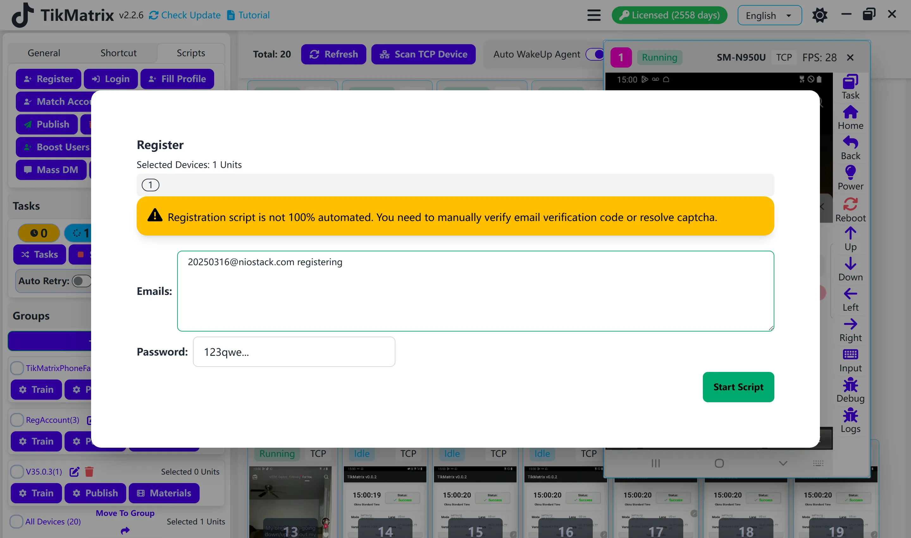

# Register

:::warning Script Discontinued
The Register script has been **discontinued** and is **no longer maintained**. This feature is no longer available in TikMatrix.
:::

~~The Register script is used to create new TikTok accounts.~~

## ~~Steps~~

~~1. Select the device to run the script.~~
~~2. Click `Script` > `Register`.~~
~~3. Configure the task settings:~~
    ~~- **Registration Emails**: Enter one email address per line.~~
    ~~- **Registration Password**: Enter the password for the new accounts.~~
~~4. Click `Start Script` to begin.~~

## ~~Note~~

~~- Registration is not fully automatic. You must manually verify the email or complete CAPTCHA challenges.~~

## Screenshot

