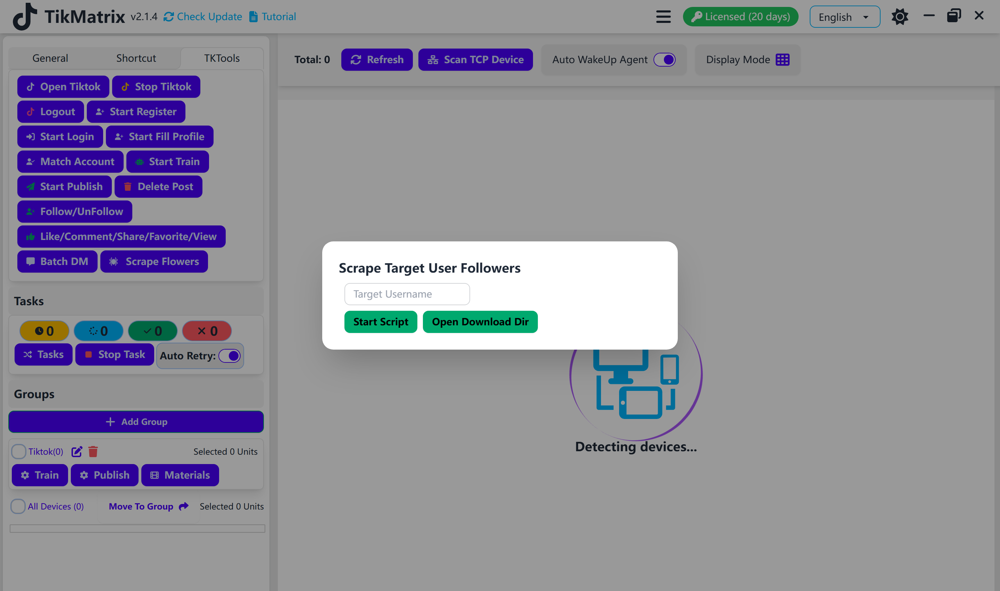

# Scrape Followers

Scrape Followers script is used to scrape followers from a target account.

## Steps

1. Select the device to scrape followers.
2. Click the `Script` - `Scrape Followers` button.
3. Enter the target account username.
4. Click the `Start` button.

## Note

* The script will scrape followers from the target account and save the data to the `download/@username.txt` file.

## Screenshot

