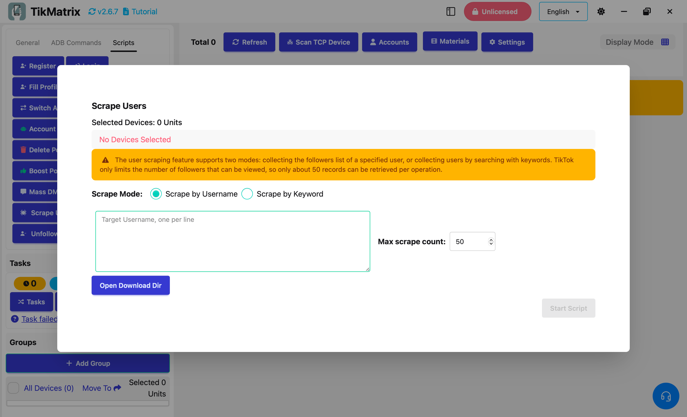

# Scrape Users

The Scrape Users script is used to scrape TikTok usernames. The user scraping feature supports two modes: collecting the followers list of a specified user, or collecting users by searching with keywords.

## Steps

1. Select the device to run the script. If you select multiple devices, the scraping tasks will be evenly distributed among the selected devices.
2. Click `Script` > `Scrape Users`.
3. Configure the task settings:
    - **Scrape Mode**: Select the mode for scraping users.
      - **Target Account Usernames**: Enter the username of the account to scrape users from. one per line.
      - **Search Keywords**: Enter keywords to search for users (if applicable).
    - **Max scrape count**: Set the maximum number of users to scrape.

4. Click `Start Script` to begin.

## Note

- The script will save the scraped users to `download/@username.txt`.
- TikTok only limits the number of users that can be viewed, so only about 50 records can be retrieved per operation.

## Screenshot

