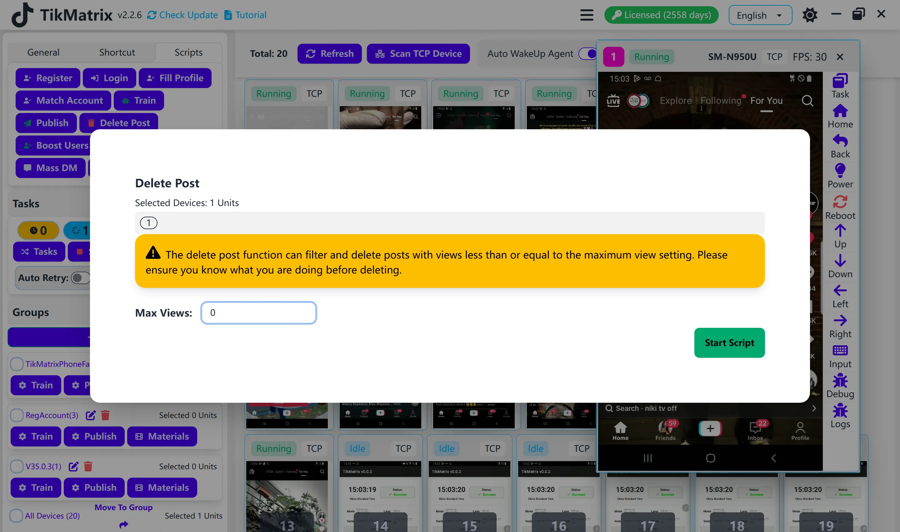

# Delete Posts

The Delete Posts script is used to remove posts based on their view count.

## Steps

1. Select the device to run the script.
2. Click `Script` > `Delete Posts`.
3. Configure the task settings:
    - **Maximum View Count**: Enter the maximum view count for posts you want to delete.
4. Click `Start Script` to begin.

## Note

- The delete posts script may not always succeed; retry failed tasks if needed.

## Screenshot

