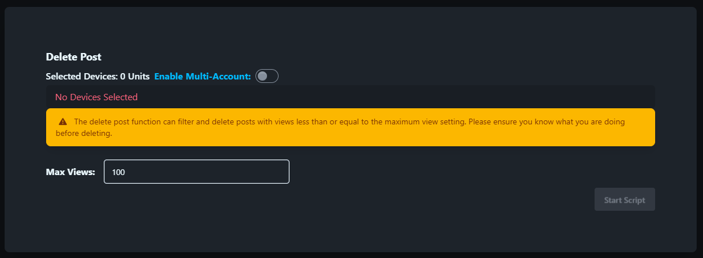

# Delete Posts

Delete Posts script is used to delete posts based on the maximum view count.

## Steps

1. Select the device.
2. Click the `Script` - `Delete Posts` button.
3. Enter the maximum view count.
4. Click the `Start` button.

## Note

* The delete posts script is not 100% successful, you may need to retry the failed tasks.

## Screenshot

