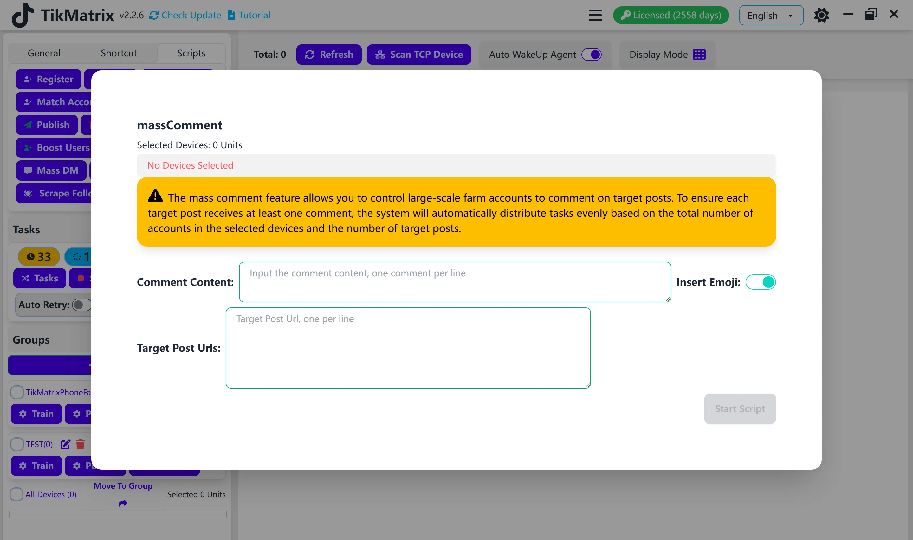

# Mass Comment

:::warning
Mass Comment lets you coordinate large groups of TikTok accounts so every target post receives a unique reply. TikMatrix automatically shares the workload across the accounts on your selected devices to guarantee that each post gets at least one comment.
:::

Use this script to publish batches of authentic-looking replies that keep your posts active, nurture audiences, or support marketing campaigns.

## Steps

1. Select the device (or devices) that hold the TikTok accounts you want to use.
2. In the app, open `Script` > `Mass Comment`.
3. Adjust the task settings as described below.
4. Press `Start Script` to launch the commenting queue.

## Task settings explained

- **Comments** – Type one comment per line. The script rotates through the list automatically.
- **Insert emojis** – Toggle on to append a friendly emoji mix to each comment.
- **Insert device number** – When enabled, TikMatrix appends the device's numeric label to each comment so you can trace which phone posted it.
- **Comment order** – Choose `Random` to shuffle the list or `Sequential` to follow the order you entered.
- **Target post URLs** – Paste the TikTok post links you want to target, one per line. The script automatically removes tracking parameters.
- **Task interval** – Use the slider to set the minimum and maximum pause (in minutes) between each comment action for every account.

:::info Distribution example
If you supply 1,000 target post URLs and select 100 TikMatrix accounts, each account will comment on roughly 10 posts. Workloads are balanced automatically.
:::

:::tip About task intervals
All devices wait for a random delay between the minimum and maximum values you set. This staggering keeps actions from firing at the exact same moment and lowers the chance of triggering platform limits.
:::

## Notes

- Review your comment list for spelling and tone; short, natural sentences perform best.
- If a comment fails, simply retry the script—the system skips completed posts.

## Screenshot

