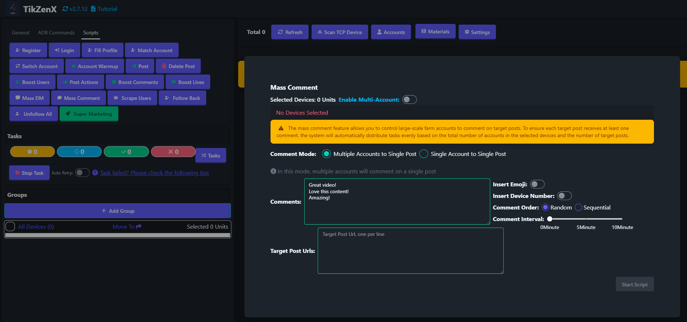

# Mass Comment

Mass Comment script is used to comment on multiple posts.

## Steps

1. Make sure the accounts are added to the account list.
2. Make sure the group is created and the device is moved to the group.
3. Click the `Script` - `Mass Comment` button.
4. Enter the comment content.
5. Input the target post URLs, one URL per line.
6. Select the device to comment.
7. Click the `Start` button.

## Note

* The mass comment script is not 100% successful, you may need retry the failed tasks.

## Screenshot

