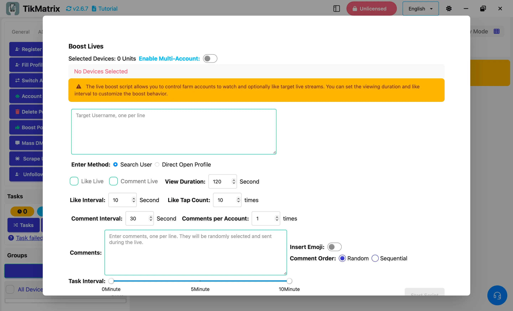

# Boost Lives

The Boost Lives script allows you to control farm accounts to watch and optionally like or comment on target live streams. You can set the viewing duration and like/comment intervals to customize the boost behavior.

## Steps

1. Select the device to run the script.
2. Click `Scripts` > `Boost Lives`.
3. Configure the task settings:
    - **Usernames**: Enter target usernames, one per line.
    - **Enter Method**: Choose between **Search** and **Direct** methods.
    - **Boost Options**: Enable liking and/or commenting.
    - **Join Fan Club**: Enable joining the streamer's fan club if available.
    - **Check in Daily**: Enable daily check-in activities during the live stream.
    - **Like Interval**: Set the interval between each like action.
    - **Like Tap Count**: Number of times to tap the like button.
    - **Comment Interval**: Set the interval between each comment action.
    - **Comment Content**: Enter one comment per line.
    - **Insert Emojis**: Choose whether to insert emojis into comments.
    - **Comment Order**: Select random or sequential order for comments.
    - **Comments per Account**: Set the number of comments to post per account.
    - **View Duration**: Set how long to stay in the live stream.
    - **Task Interval**: Set the interval between each task.
4. Click `Start Script` to begin.

## Notes

- The boost live script may not always succeed; retry failed tasks if needed.

## Screenshot

