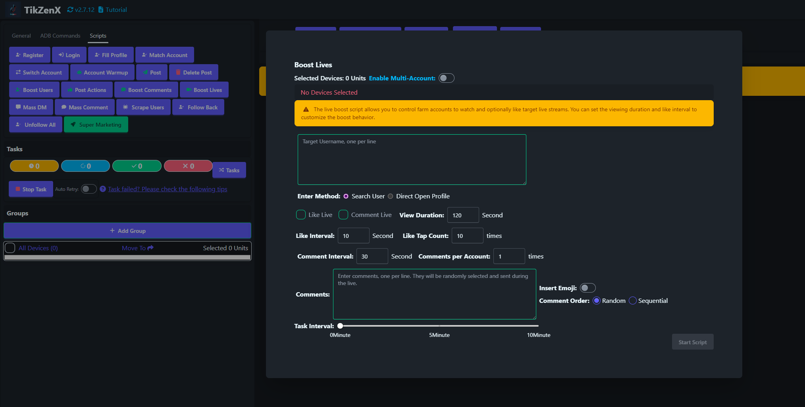

# Boost Lives

Boost Lives script is used to like, view on target live streams.

## Steps

1. Ensure the account is added to the account list.
2. Ensure the group is created and the device is moved to the group.
3. Click `Scripts` - `Boost Lives` button.
4. Input the target live stream link, one per line.
5. Select the device to operate.
6. Select the operation type, like or view.
7. Click `Start` button.

## Notes

* The boost live script is not 100% successful, you may need to retry the failed tasks.

## Screenshots

