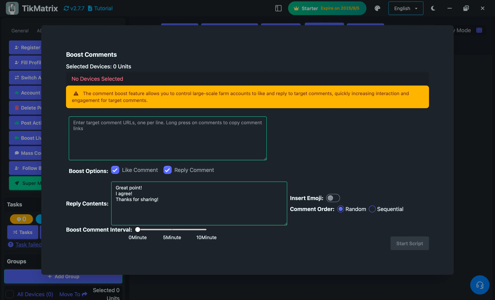

# Boost Comments

The Boost Comments script is used to boost engagement on specific TikTok comments by liking them and replying to them in bulk.

## Steps

1. Select the device to run the script.
2. Click `Script` > `Boost Comments`.
3. Configure the task settings:
    - **Target Comment URLs**: Enter target comment URLs, one per line. Long press on comments to copy comment links.
    - **Boost Options**: Choose the boost actions:
        - **Like Comment**: Like the target comments
        - **Reply Comment**: Reply to the target comments
    - **Reply Contents**: Enter reply content, one reply per line (only needed if Reply Comment is enabled).
    - **Insert Emojis**: Choose whether to insert random emojis into replies.
    - **Comment Order**: Select how to choose from multiple reply contents:
        - **Random**: Randomly select from the reply contents
        - **Sequential**: Use reply contents in sequential order
    - **Boost Comment Interval**: Set the interval between each boost task.
4. Click `Start Script` to begin.

## Features

- **Direct Comment Links**: Works with direct comment URLs copied from TikTok
- **Multiple Actions**: Can like comments and reply to them simultaneously
- **Content Variety**: Supports multiple reply contents with random or sequential selection
- **Emoji Support**: Automatically insert emojis to make replies more engaging
- **Efficient Processing**: Processes multiple comment URLs in batch

## Note

- The boost comments script may not always succeed; retry failed tasks if needed.
- Use direct comment URLs for best results. Long press on comments in TikTok to copy their links.
- Reply contents should be appropriate and follow TikTok's community guidelines.

## Screenshot

