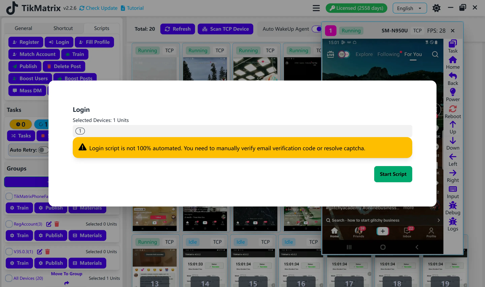

# Login

The Login script is used to log in to social media accounts.

## Steps

1. Make sure the account is added to the account list (click `Accounts` to add accounts), and select the device index you want to use for this account.
2. Single-select or multi-select the device(s) to run the login script.
3. Click `Script` > `Login`.
4. Click `Start Script` to begin.

## Login Priority

The system uses the following login priority:

1. **Email + Password**: If an email is configured for the account, it will be used for login first.
2. **Username + Password**: If no email is configured, the username will be used for login.

## 2FA Support (IgMatrix Only)

IgMatrix supports automatic Two-Factor Authentication (2FA) login:

### Password Format for 2FA

To use 2FA, format your password as follows:

```plaintext
your_password:your_2fa_secret_key
```

**Example:**

```plaintext
mypassword123:JBSWY3DPEHPK3PXP
```

### How 2FA Works

1. **Password Parsing**: The system automatically detects if your password contains a colon (`:`) separator.
2. **Token Generation**: When 2FA is required, the system uses your secret key to request a TOTP code from our 2FA service.
3. **Automatic Input**: The generated 6-digit code is automatically entered into the Instagram 2FA field.
4. **Seamless Login**: The entire 2FA process happens automatically without manual intervention.

### 2FA Secret Key

The 2FA secret key is typically a 32-character Base32-encoded string that you get when setting up 2FA in Instagram. It's the same key used by authenticator apps like Google Authenticator or Authy.

### Where to Get 2FA-Enabled Instagram Accounts

You can purchase Instagram accounts with 2FA support from: [AccsMarket](https://accsmarket.com/en/?ref=802647)

## Note

- TikTok login is not 100% fully automatic. You may need to manually enter email verification codes or complete other verification steps. We cannot bypass TikTok-specific login challenges (such as image CAPTCHAs or human verification) or resolve certain error messages like "too many login attempts".
- Instagram can achieve 100% automated login via 2FA. For 2FA-enabled Instagram accounts, make sure to use the correct secret key format in your password.

## Screenshot


