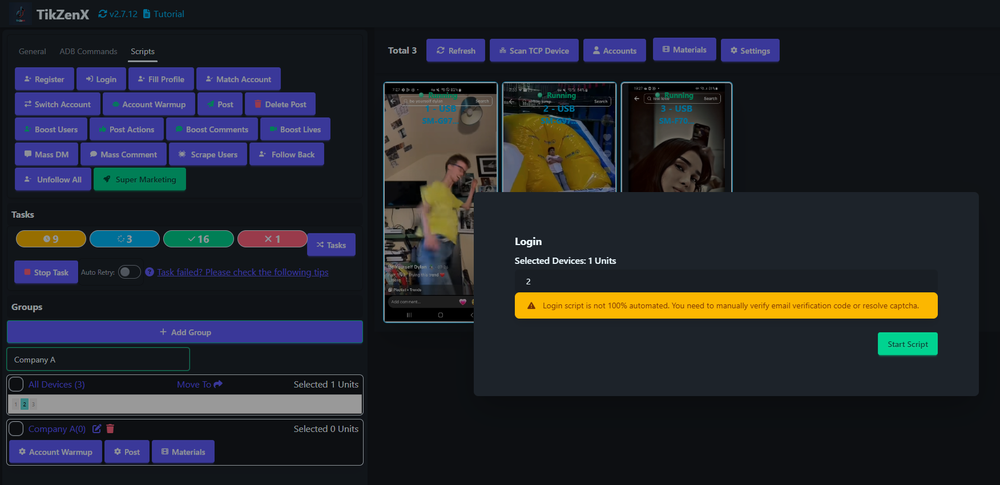

# Login

Login script is used to login to the account on TikTok.

## Steps

1. Make sure the account is added to the account list.(You can click the `Accounts` to add the account.)
2. Select the device to run the script.
3. Click the `Script` - `Login` button.
4. Click the `Start Script` button to create the tasks.

## Note

* The login script is not 100% automatic, You need to manually verify the CAPTCHA or other verification.

## Screenshot

