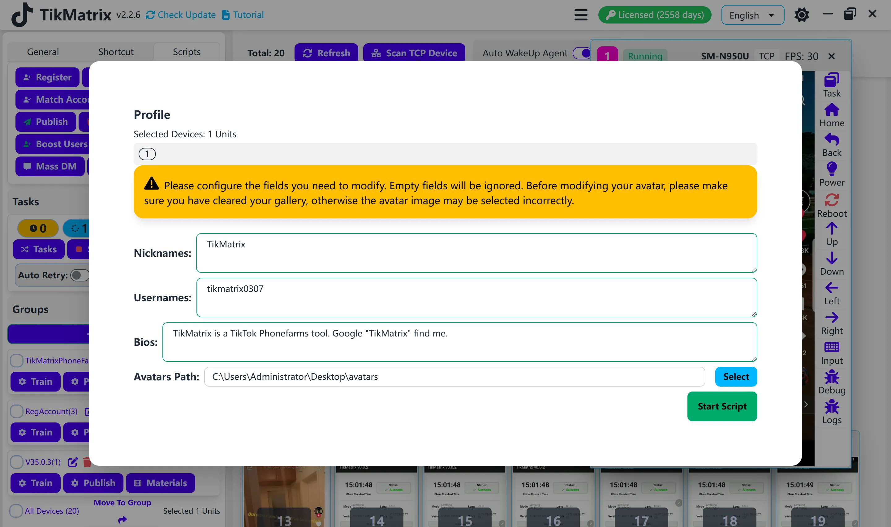

# Profile

The Profile script is used to set up account profiles.

## Steps

1. Select the device to run the script.
2. Click `Script` > `Fill Profile`.
3. Configure the task settings:
    - **Nicknames**: One nickname per line.
    - **Usernames**: One username per line.
    - **Bios**: One bio per line (supports mentioning users and line breaks).
      - To add line breaks in bio, use `\n` in your text. For example: `First line\nSecond line\nThird line`
    - **Avatar Path**: File path to the avatar image folder.
    - **Selection Order**: Choose how content is selected for each task:
      - **Random**: Randomly selects from available options for each task (default).
      - **Sequential**: Selects content in order based on task count. Use this mode to ensure each account gets unique information.
4. Click `Start Script` to begin.

## Selection Order Guide

### Random Mode

- Content (nicknames, usernames, bios, avatars) is randomly selected for each task
- The same content may be used multiple times across different accounts
- Suitable when content uniqueness is not critical

### Sequential Mode

- Content is selected in order: 1st task gets 1st item, 2nd task gets 2nd item, etc.
- When all items are used, it cycles back to the beginning
- **Important**: To ensure each account gets unique information, make sure you provide more items than the total number of accounts in a single batch run
  - Example: If running 100 accounts, provide at least 100 unique nicknames, usernames, bios, and avatar images

## Note

- It is recommended to clear the gallery before setting the profile, as the script uses the first photo as the avatar.

## Screenshot

