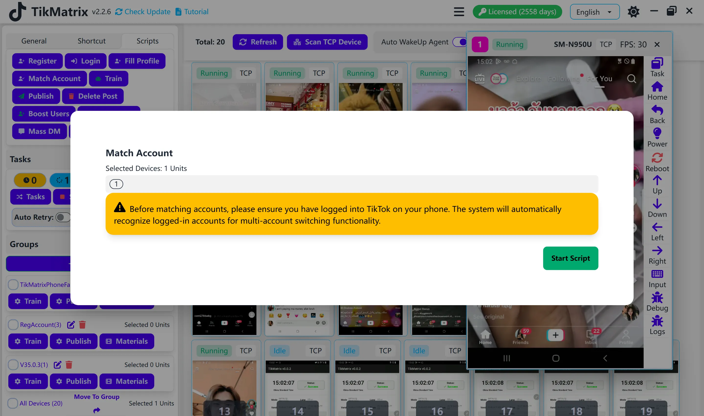

# Match Accounts

The Match Accounts script is used to recognize TikTok accounts from the phone and add them to the account list.

## Steps

1. Select the device to run the script.
2. Click `Script` > `Match Accounts`.
3. Click `Start Script` to begin.
4. The script will automatically recognize accounts on the phone and add them to the account list.

## Note

- The match accounts script may not recognize all accounts in one run. If some accounts are missed, try running the script again.

## Screenshot

