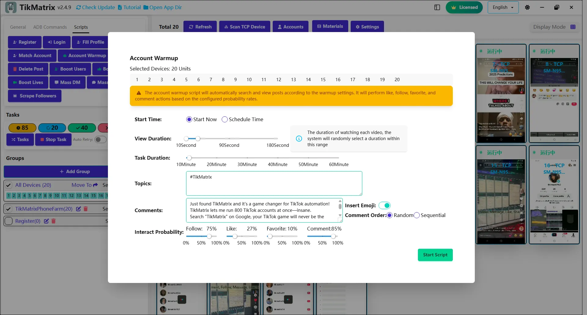

# Account Warmup

The Account Warmup script is used to warm up accounts by searching keywords, watching videos, following, liking, commenting, and favoriting.

## Steps

1. Select the device to run the script.
2. Click `Script` > `Account Warmup`.
3. Configure the task settings:
   - **View Duration**: How long to watch each video.
   - **Search Keywords**: Topics to search for videos.
   - **Task Duration**: Total duration of the warmup task.
   - **Comment Contents**: Use pre-made comments or ChatGPT-generated comments from post captions.
   - **Interact Probability**: Probability of following, liking, commenting, and favoriting.
4. Click `Start Script` to begin.

## Note

- The warmup script may not always succeed; retry failed tasks if needed.
- Supports scheduling, so you can set the warmup task to run at a specific time.
- Supports skipping ads, live streams, and already liked videos.

## Screenshot

