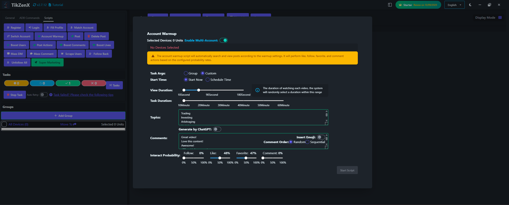

# Account Warmup

Account Warmup script is used to warm up the accounts by searching keywords, watching videos, following, liking, commenting, and favoriting.

## Steps

1. Select the device to train.
2. Click the `Script` - `Account Warmup` button.
3. Configure the warmup settings: search duration, search keywords, watch videos, follow, like, comment, and favorite.
4. Click the `Start Script` button to start the warmup.

## Note

* The warmup script is not 100% successful, you may need retry the failed tasks.
* You can also turn on the schedule warmup to create warmup tasks automatically at a specific time.

## Screenshot

