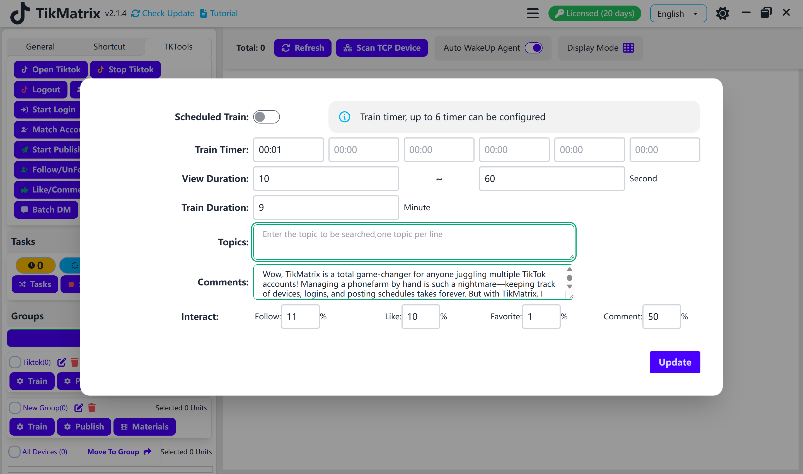

# Train

Train script is used to train the accounts by searching keywords, watching videos, following, liking, commenting, and favoriting.

## Steps

1. Make sure the accounts are added to the account list.
2. Make sure the group is created and the device is moved to the group.
3. Configure the train settings on the group: search duration, search keywords, watch videos, follow, like, comment, and favorite.
4. Select the device to train.
5. Click the `Script` - `Train` button.
6. Every account on the device will be created a train task.

## Note

* The train script is not 100% successful, you may need retry the failed tasks.
* You can also turn on the schedule train to create train tasks automatically at a specific time.

## Screenshot

