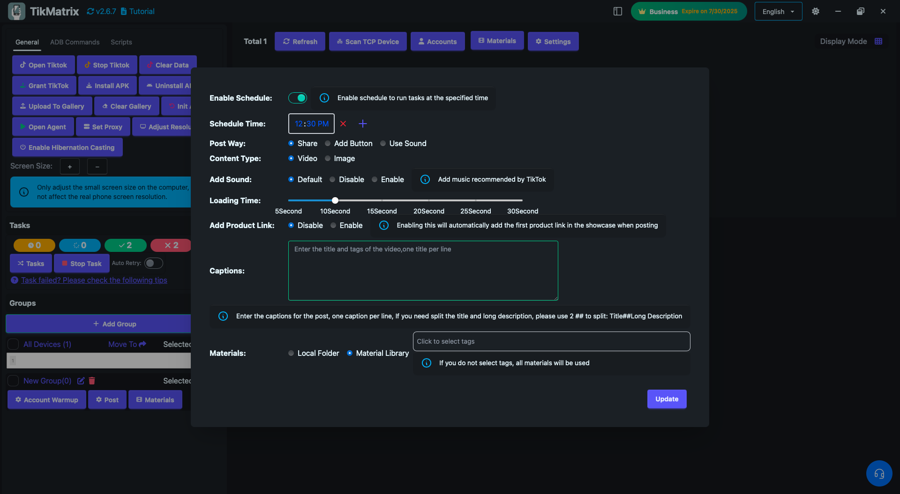
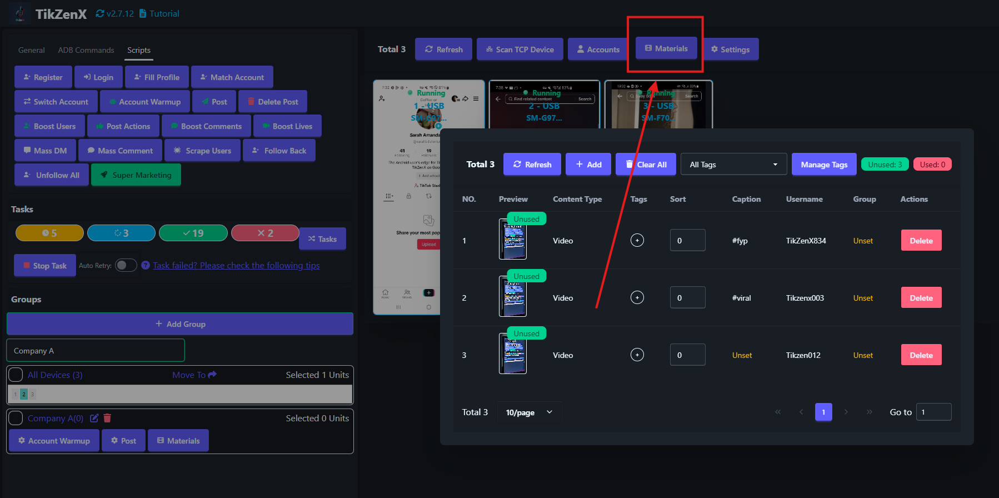

# Post

The Post script is used to publish videos or images to TikTok.

## Steps

1. Click the `Material` button to upload videos/images to the material library.
2. Select the device to run the script.
3. Click `Script` > `Post`.
4. Configure the task settings:
    - **Post Way**: Choose how to post: System Share or Add Button(`+`) or Use Sound by Search.
    - **Content Type**: Select video or image.
    - **Add Sound Switch**: Enable/disable adding sound.
    - **Add Product Link Switch**: Enable/disable adding a product link.
    - **Captions**: Set captions, including mentions (@TikMatrixPhoneFarm) and tags (#tag1 #tag2 #tag3). Use one caption per line. To split title and description, use `##` (e.g., Title##Long Description).
    - **Material Tags**: Filter materials by tags. If not set, all materials are used.
5. Click `Start Script` to begin.

## Material Management

- **Material Tags**: Add tags to materials for filtering during posting. If no tag is specified, all materials are used.
- **Material Caption**: You can set a custom caption for each material. If set, it takes priority over the post settings.
- **Material Username**: You can set a custom username for each material. Materials matching the username are prioritized.
- **Material Order**: Set the order number for materials (useful for multi-image posts; lower numbers appear first).

## Note

- The post script may not always succeed; retry failed tasks if needed.
- Supports scheduling to run the post task at a specific time.
- Tasks will fail if there are not enough materials in the library.

## Screenshot

