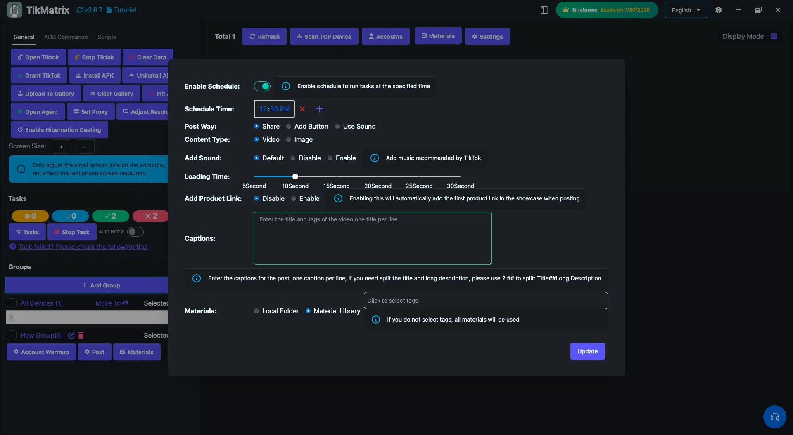
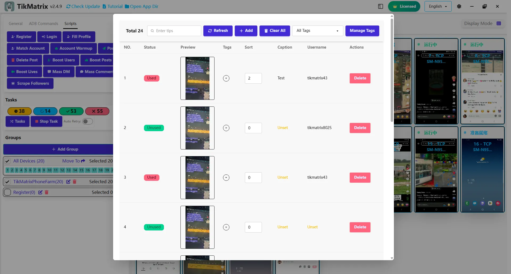

# Post

The Post script is used to publish videos or images to TikTok.

## Steps

1. **Prepare Materials**:
   - Option 1: Click the `Material` button to upload videos/images to the material library.
   - Option 2: Use local folder as material source by setting the folder path in the script configuration.
2. Select the device to run the script.
3. Click `Script` > `Post`.
4. Configure the task settings:
    - **Material Source**: Choose between Material Library or Local Folder.
    - **Local Folder Path**: If using local folder, specify the path containing your videos/images.
    - **Post Way**: Choose how to post: System Share or Add Button(`+`) or Use Sound by Search.
    - **Sound Name**: When using "Use Sound by Search" post way, you can either:
      - Enter a sound name to search (e.g., "original sound", "trending music")
      - Enter a TikTok sound URL directly (e.g., `https://www.tiktok.com/t/ZP8hvBwCb/`)
    - **Content Type**: Select video or image.
    - **Add Sound Switch**: Enable/disable adding sound.
    - **Upload Wait Time**: Set a delay (5-60 seconds) after uploads to ensure TikTok servers fully process the content before proceeding.
    - **Add Product Link Switch**: Enable/disable adding a product link.
    - **Captions**: Set captions, including mentions (@TikMatrixPhoneFarm) and tags (#tag1 #tag2 #tag3). Use one caption per line. To split title and description, use `##` (e.g., Title##Long Description).
    - **Material Tags**: Filter materials by tags. If not set, all materials are used.
5. Click `Start Script` to begin.

## Material Management

### Use Sound Modes

When **Post Way** is set to "Use Sound by Search", the script supports two different modes for adding music:

#### 1. Sound Search Mode

Enter a sound name to search for music within TikTok:

- Examples: `original sound`, `trending music`, `viral beat`
- The script will search TikTok's music library and select the first matching result
- This mode is useful when you want to use popular or trending sounds

#### 2. Sound URL Mode

Enter a direct TikTok sound URL to use specific music:

- Supported URL formats:
  - Short links: `https://www.tiktok.com/t/ZP8hvBwCb/`
  - Music pages: `https://www.tiktok.com/music/original-sound-7473897776619834646`
  - VM links: `https://vm.tiktok.com/ZMhvBwCbD/`
- The script automatically detects URLs starting with `https://` and opens them directly
- This mode is useful when you want to use a specific sound from a particular video

### Material Library

- **Material Tags**: Add tags to materials for filtering during posting. If no tag is specified, all materials are used.
- **Material Caption**: You can set a custom caption for each material. If set, it takes priority over the post settings.
- **Material Username**: You can set a custom username for each material. Materials matching the username are prioritized.
- **Material Order**: Set the order number for materials (useful for multi-image posts; lower numbers appear first).

### Local Folder Source

- **Folder Structure**:

  ```text
  /path/to/materials/
  ├── caption.txt (optional - root fallback)
  ├── sound_names.txt (optional - root fallback)  
  ├── sound_urls.txt (optional - root fallback)
  ├── @username1/
  │   ├── video1.mp4
  │   ├── video2.mp4
  │   ├── image1.webp
  │   ├── image2.webp
  │   ├── caption.txt (optional)
  │   ├── sound_names.txt (optional)
  │   └── sound_urls.txt (optional)
  ├── @username2/
  │   ├── content1.mp4
  │   ├── content2.webp
  │   ├── caption.txt (optional)
  │   ├── sound_names.txt (optional)
  │   └── sound_urls.txt (optional)
  └── ...
  ```

- **Folder Path**: Specify the root path containing username subfolders.
- **Username Subfolders**: Each username must have its own subfolder (e.g., `@username1`, `@username2`).
- **Root Folder Fallback**: If a username folder doesn't exist or username is empty, materials and settings will be read from the root folder.
- **Supported Formats**:
  - Videos: MP4, AVI, MOV, MKV, WebM, M4V
  - Images: JPG, JPEG, PNG, GIF, BMP, WebP
- **Caption File**: Optional `caption.txt` file in each username folder for custom captions. If not found, falls back to root folder's `caption.txt`.
- **Sound Files**:
  - **sound_names.txt**: Contains sound names for searching, one per line. Read sequentially and loops when reaching the end.
  - **sound_urls.txt**: Contains TikTok sound URLs, one per line. Read sequentially and loops when reaching the end.
  - If username folder doesn't exist, reads from root folder's sound files.
- **File Selection**:
  - For videos: One random video per post
  - For images: Multiple images based on image count setting
- **Usage Tracking**: Files are automatically marked as used to avoid repetition.
- **Spintax Support**: Caption files support spintax format `{option1|option2|option3}` for random text generation.

  **Spintax Examples:**

  ```text
  {Good morning|Hello|Hi there}! Check out this {amazing|incredible|awesome} video!
  ```

  Will randomly generate one of:
  - "Good morning! Check out this amazing video!"
  - "Hello! Check out this incredible video!"
  - "Hi there! Check out this awesome video!"

  **Complex Spintax Example:**

  ```text
  {🔥|✨|🎉} {Don't miss|Check out|Watch} this {amazing|incredible|fantastic} {video|content|post}! 
  {Follow for more|Like and share|Tag your friends} {#trending|#viral|#fyp} #tiktok
  ```

  **Caption.txt File Example:**

  ```text
  {Morning motivation|Daily inspiration|Start your day right}! 💪
  
  {Loving|Enjoying|Obsessed with} this {beautiful|stunning|gorgeous} view! 🌅
  
  {Can't believe|So excited about|Thrilled with} this {moment|experience|adventure}! ✨
  ```

  **Sound_names.txt File Example:**

  ```text
  original sound
  trending music
  viral beat
  popular song
  dance music
  ```

  **Sound_urls.txt File Example:**

  ```text
  https://www.tiktok.com/t/ZP8hvBwCb/
  https://www.tiktok.com/music/original-sound-7473897776619834646
  https://vm.tiktok.com/ZMhvBwCbD/
  https://www.tiktok.com/t/ZP8hvBwCb/
  ```

## Note

- The post script may not always succeed; retry failed tasks if needed.
- Supports scheduling to run the post task at a specific time.
- Tasks will fail if there are not enough materials in the library.
- When using local folder source:
  - Each username must have its own subfolder under the root material path, or use the root folder directly if username is empty.
  - If a username folder doesn't exist, the script will fallback to read materials and settings from the root folder.
  - The script will randomly select files to avoid posting the same content repeatedly.
  - Files are automatically tracked as used; when all files are used, an error will occur.
  - Create a `caption.txt` file in each username folder or root folder for custom captions.
  - Create `sound_names.txt` for sequential sound name reading (loops automatically).
  - Create `sound_urls.txt` for sequential sound URL reading (loops automatically).
  - Caption files support spintax format for random text variations.
  - Supported video formats: MP4, AVI, MOV, MKV, WebM, M4V.
  - Supported image formats: JPG, JPEG, PNG, GIF, BMP, WebP.

## Screenshot




## Related Documentation

- [Permission Denied - Unable to Save Draft Videos](../troubleshooting/4.permission-denied-draft-videos.md)
