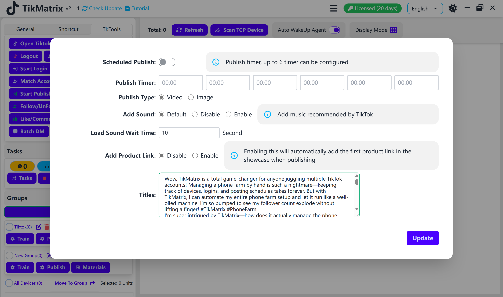
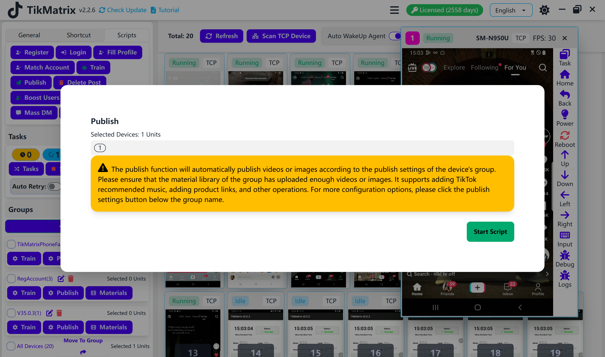

# Publish

Publish script is used to publish videos or images to TikTok.

## Steps

1. Make sure the accounts are added to the account list.
2. Make sure the group is created and the device is moved to the group.
3. Configure the publish settings on the group: caption, tags, video/image, sound, and product link.
4. Make sure the video/image is uploaded to the material library.
5. Select the device to publish.
6. Click the `Script` - `Publish` button.
7. Every account on the device will be created a publish task.

## Note

* The publish script is not 100% successful, you may need retry the failed tasks.
* You can also turn on the schedule publish to create publish tasks automatically at a specific time.
* Tasks will be failed if there are no enough materials in the material library.

## Screenshot

