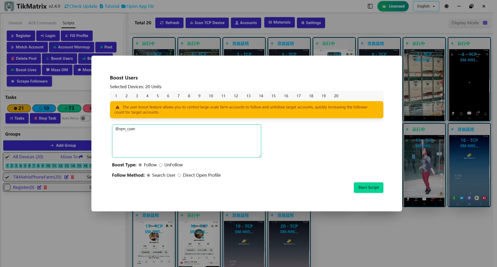

# Boost Users

The Boost Users script is used to increase user engagement by following or unfollowing accounts in bulk.

:::warning Legacy Notice
This script has been merged into the Super Marketing script. Please use the Super Marketing script instead; this script will be removed in a future release.
:::

## Steps

1. Select the device to run the script.
2. Click `Script` > `Boost Users`.
3. Configure the task settings:
    - **Boost Type**: Choose follow or unfollow.
    - **Target Usernames Path**: Select a file with target usernames (one per line).
    - **Follow Method**: Choose how to follow users: **Search User** (by username) or **Direct Open Profile** (by opening the profile directly).
4. Click `Start Script` to begin.

## Note

- The follow/unfollow script may not always succeed; retry failed tasks if needed.

## Screenshot

