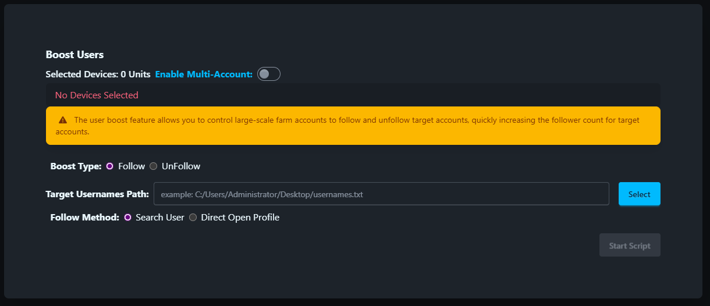

# Boost Users

Boost Users script is used to boost users by following/unfollowing.

## Steps

1. Make sure the accounts are added to the account list.
2. Make sure the group is created and the device is moved to the group.
3. Click the `Script` - `Boost Users` button.
4. Enter the target account usernames, one username per line.
5. Select the device to follow/unfollow.
6. Select the type of follow/unfollow.
7. Click the `Start` button to begin the Boost Users task.

## Note

* The follow/unfollow script is not 100% successful, you may need retry the failed tasks.

## Screenshot

