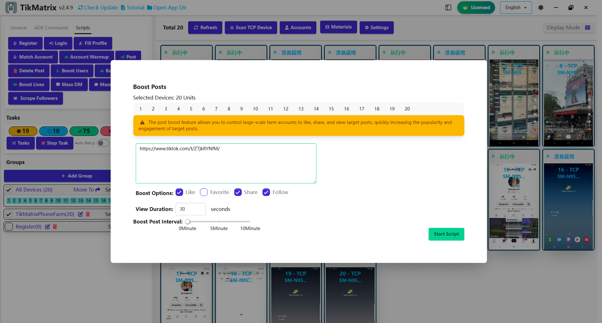

# Boost Posts

Boost Posts script is used to boost posts by liking, sharing, favoriting, and viewing.

## Steps

1. Make sure the accounts are added to the account list.
2. Make sure the group is created and the device is moved to the group.
3. Select the device to boost posts.
4. Click the `Script` - `Boost Posts` button.
5. Enter the target post URLs, one URL per line.
6. Select the type of boost posts.
7. Click the `Start` button to begin the Boost Posts task.

## Note

* The boost posts script is not 100% successful, you may need retry the failed tasks.

## Screenshot

