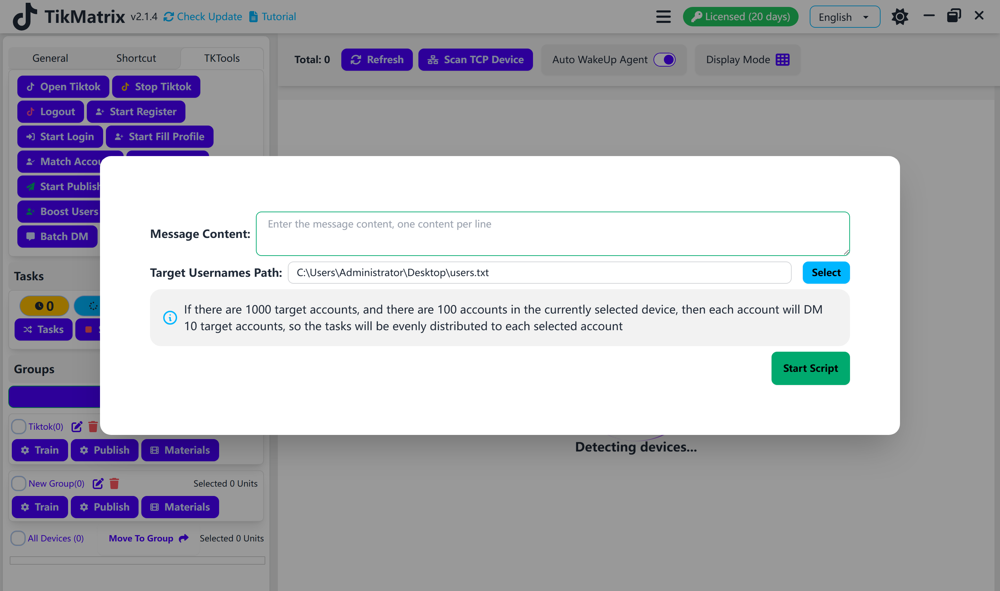

# Batch DM

Batch DM script is used to send messages to multiple accounts.

## Steps

1. Make sure the accounts are added to the account list.
2. Make sure the group is created and the device is moved to the group.
3. Click the `Tk Toolbox` - `Batch DM` button.
4. Enter the message content.
5. Select the target accounts file, one account per line.
6. Select the device to send messages.
7. Click the `Start Script` button.

## Note

* The batch DM script is not 100% successful, you may need retry the failed tasks.

## Screenshot

