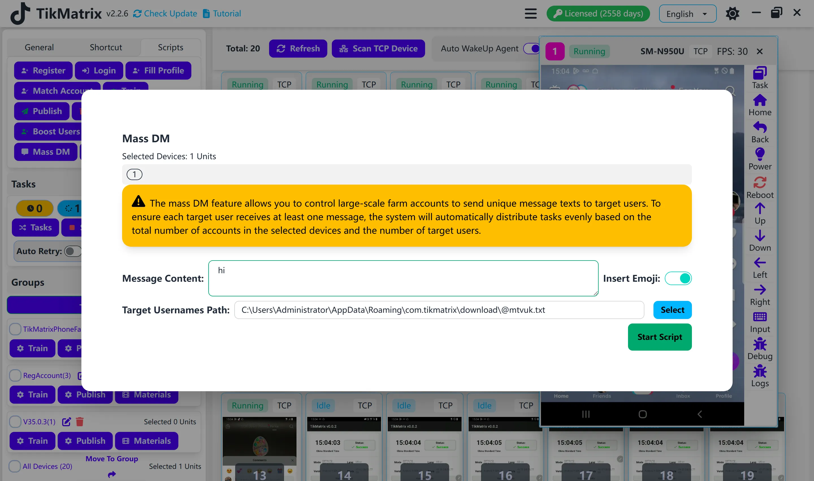

# Mass DM

The Mass DM script is used to send messages to multiple TikTok accounts in bulk.

## Steps

1. Select the device to run the script.
2. Click `Script` > `Mass DM`.
3. Configure the task settings:
    - **Message Content**: Enter the message to send. You can add multiple lines to rotate through different messages automatically.
    - **Insert Emojis**: Toggle whether to append friendly emojis to each message for additional variation.
    - **Target Accounts File**: Select a plain text file with target accounts, one handle per line (with or without the leading `@`).
    - **Open User Method**: Choose `Search` to find each account via TikTok search or `Direct` to open the profile URL immediately.
4. Click `Start Script` to begin.

## Note

- TikMatrix only automates the DM sending process. We cannot guarantee that accounts remain safe from bans or that every message will reach its recipient.
- The mass DM script may not always succeed; retry failed tasks if needed.

## Screenshot

