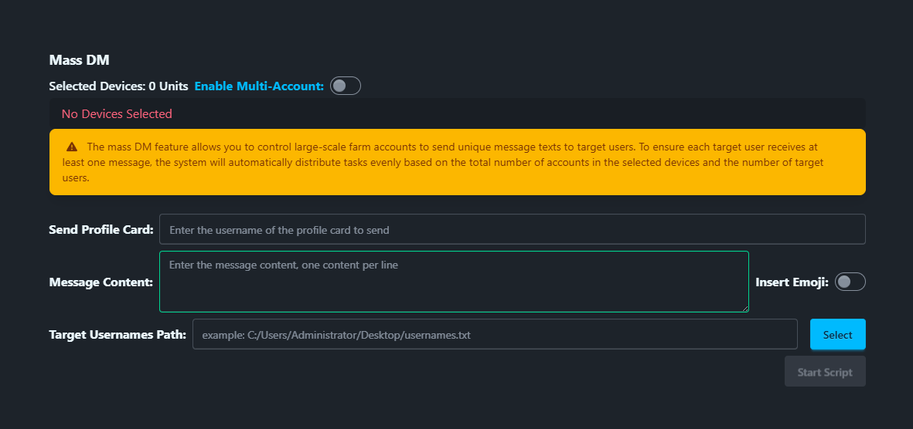

# Mass DM

The Mass DM script is used to send messages to multiple TikTok accounts in bulk.

## Steps

1. Select the device to run the script.
2. Click `Script` > `Mass DM`.
3. Configure the task settings:
    - **Send Profile Card**: Choose whether to send a profile card with the message (e.g., @tikmatrix001).
    - **Message Content**: Enter the message to send.
    - **Insert Emojis**: Choose whether to insert emojis into the message.
    - **Target Accounts File**: Select a file with target accounts, one per line.
4. Click `Start Script` to begin.

## Note

- The mass DM script may not always succeed; retry failed tasks if needed.

## Screenshot

