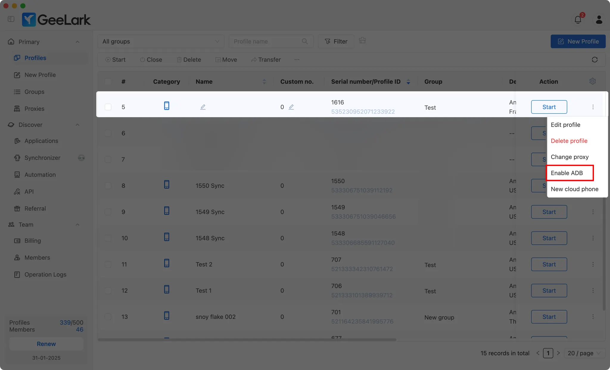

# Подключение к облачному телефону

Это руководство поможет вам подключить облачные телефоны GeeLark к TikMatrix.

:::warning Рекомендации по сети
Пожалуйста, убедитесь, что ваш компьютер и дата-центр CloudPhone имеют достаточную и стабильную пропускную способность сети. Для обеспечения наилучшей надежности автоматизированных задач рекомендуется, чтобы ваш компьютер и дата-центр облачного телефона находились в одной стране или регионе, чтобы уменьшить задержку и потерю пакетов.
:::

Вы можете приобрести облачные телефоны на [GeeLark](https://www.geelark.cn?invite_code=XHY6a8).

## Включение ADB

Включите ADB для нужных профилей облачных телефонов в разделе профилей.



Вы также можете включить ADB для нескольких профилей одновременно.


## Запуск профиля

После открытия профиля нажмите на иконку 🔗, чтобы получить IP-адрес, порт и код подключения облачного телефона.


## Способ 1: Быстрое подключение через список облачных телефонов (рекомендуется)

TikMatrix теперь поддерживает сохранение информации о подключении облачных телефонов для быстрого подключения одним кликом.

### Сохранение информации об облачном телефоне

1. Откройте TikMatrix и нажмите кнопку `Сканировать TCP устройства`.
2. Переключитесь на вкладку `Список облачных телефонов`.
3. Нажмите кнопку `Добавить`.
4. Заполните информацию об облачном телефоне:
   - **Название**: Удобное имя для идентификации вашего облачного телефона (например, "GeeLark Phone 1")
   - **IP-адрес**: IP-адрес от GeeLark (например, `1.2.3.4`)
   - **Порт**: Номер порта (по умолчанию: `5555`)
   - **Код авторизации**: Код подключения от GeeLark (например, `f850ef`)
5. Нажмите `Сохранить`.

### Подключение одним кликом

После сохранения вы можете подключиться двумя способами:

**Одиночное подключение:**

- Нажмите кнопку 🔌 рядом с любым облачным телефоном в списке.

**Массовое подключение:**

- Выберите несколько облачных телефонов с помощью флажков.
- Нажмите кнопку `Подключить (X)` вверху.

Система автоматически выполнит:

1. Подключение через ADB
2. Выполнение команды аутентификации glogin
3. Отображение результатов подключения

После успешного подключения обновите список устройств, чтобы увидеть ваши облачные телефоны.

## Способ 2: Ручное подключение через терминал ADB

Если вы предпочитаете ручное подключение или нужно устранить неполадки:

### Выполнение команд ADB

1. В TikMatrix нажмите `Настройки` > `Открыть терминал ADB`.
2. Выполните команду подключения в зависимости от вашей операционной системы и проверьте, появился ли ваш телефон в списке со статусом `device`.
3. Выполните команду аутентификации для подтверждения подключения.

### Для систем Windows

```shell
.\adb.exe connect <IP_ADDRESS>:<PORT>
.\adb.exe -s <IP_ADDRESS>:<PORT> shell glogin <CONNECTION_CODE>
```

### Для систем Mac/Linux

```shell
./adb connect <IP_ADDRESS>:<PORT>
./adb -s <IP_ADDRESS>:<PORT> shell glogin <CONNECTION_CODE>
```

> Например, если ваш IP-адрес `1.2.3.4`, порт `5555`, а код подключения `f850ef`
>
> **Windows:**
>
> ```shell
> .\adb.exe connect 1.2.3.4:5555
> .\adb.exe -s 1.2.3.4:5555 shell glogin f850ef
> ```
>
> **Mac/Linux:**
>
> ```shell
> ./adb connect 1.2.3.4:5555
> ./adb -s 1.2.3.4:5555 shell glogin f850ef
> ```

## Советы

- Сохраните все облачные телефоны в списке для быстрого доступа.
- Статус подключения отображается рядом с каждым облачным телефоном.
- Вы можете редактировать или удалять сохранённые облачные телефоны в любое время.
- Информация о подключении хранится локально на вашем компьютере.
