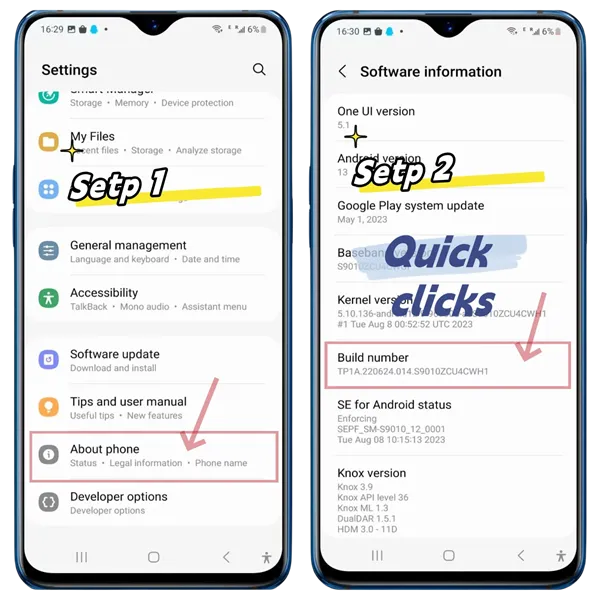
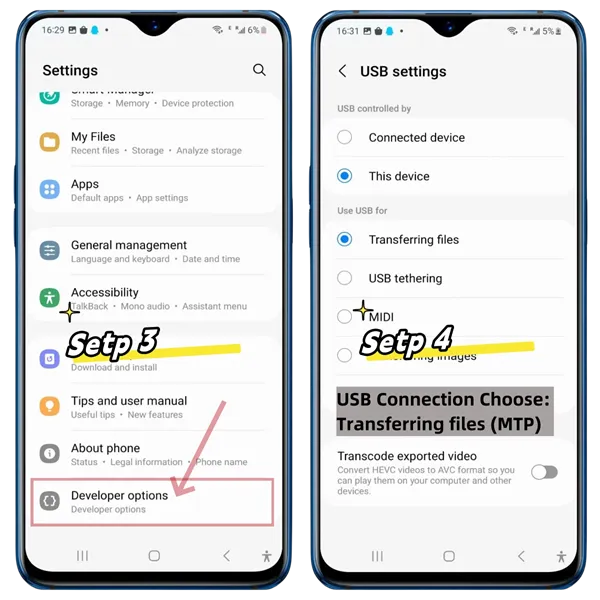
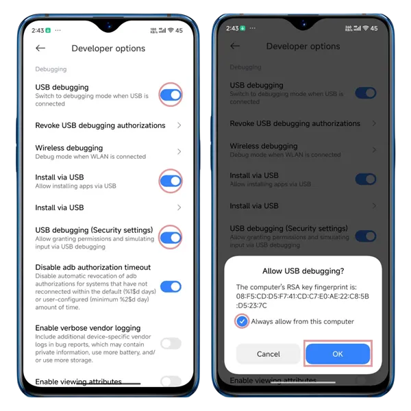
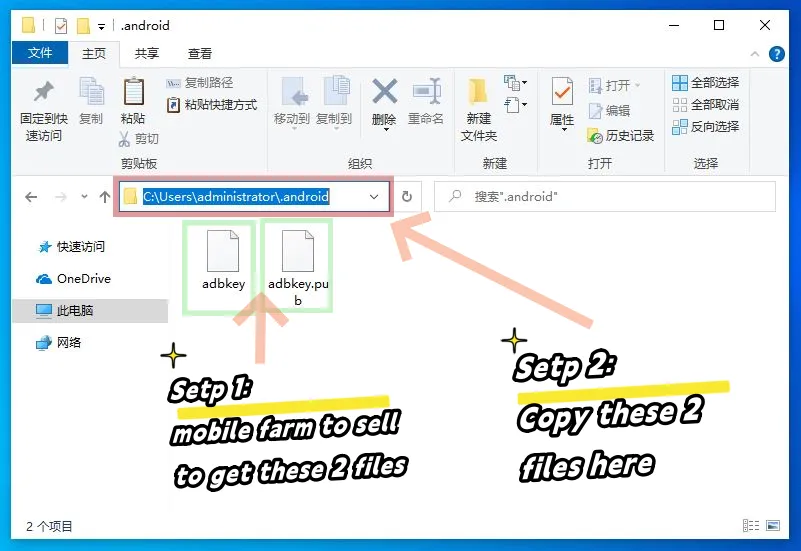

# Подключение устройств

TikMatrix поддерживает USB и TCP соединения для Android-устройств.

## USB соединение

1. Откройте настройки разработчика на телефоне и включите отладку по USB (см. скриншоты ниже).
   - **Для телефонов Xiaomi**: Вам также необходимо включить опции "Установка через USB" (Install via USB) и "Отладка по USB (Настройки безопасности)" (USB debugging (Security Settings)) в настройках разработчика.
2. Подключите телефон к компьютеру через USB.
3. Когда появится запрос на телефоне, нажмите `Разрешить` для включения отладки по USB.
4. Дождитесь установления соединения.

## TCP соединение

1. Подключите телефон к компьютеру через USB.
2. В TikMatrix нажмите `ADB команды` > `Включить TCP` для включения TCP/IP соединения.
3. Отключите USB кабель (если используете телефонную коробку, можете переключиться в режим OTG).
4. Нажмите кнопку `Сканировать TCP устройства` и введите диапазон IP (эту информацию можно найти на странице управления роутером).
5. Нажмите `Сканировать` для поиска устройств в указанном диапазоне IP.
6. Дождитесь установления соединения.

**Для облачных телефонов**: TikMatrix теперь поддерживает сохранение подключений облачных телефонов для быстрого доступа. Переключитесь на вкладку `Список облачных телефонов` в диалоге сканирования, чтобы сохранять и управлять подключениями облачных телефонов. Подробные инструкции см. в руководстве [Подключение к облачному телефону](./1.connect-to-cloudphone.md).

## Скриншоты

### Советы

- Операционные шаги могут отличаться у разных брендов, но основной процесс схож.
- Если нет ответа, попробуйте заменить кабель данных или использовать USB порт на задней панели компьютера.

## Как подключиться к материнской плате или корпусу

1. Попросите у продавца материнской платы или корпуса файлы авторизации `adbkey` и `adbkey.pub`.
2. Скопируйте эти файлы в директорию `C:\Users\ваше_имя_пользователя\.android` на вашем компьютере.
3. Перезагрузите компьютер.

## Скриншот файлов ADB ключей

### Другие советы

- Сделайте резервную копию ваших файлов авторизации. Если переустановите систему или смените компьютер, они понадобятся снова.
- Если эти файлы потеряны, вам нужно будет вручную разрешить права на экране телефона.

## Как подключить больше USB устройств

💡 Теоретически USB поддерживает до 127 устройств.  
Но на практике, большинство потребительских материнских плат ограничивают это количество примерно до 40 устройств из-за ограничений прошивки и чипсета.

🖥️ Материнские платы серверного класса (например, архитектуры X79) отличаются — они обычно снимают эти USB-ограничения, позволяя масштабировать систему значительно больше.

🔧 Как успешно подключить больше устройств:

1. Используйте USB-порты на задней панели ПК — они подключены более напрямую к материнской плате.  
2. Используйте порты USB 2.0 (обычно черные), а не USB 3.0 (синие), которые могут быть нестабильными для больших ферм.  
3. В настройках BIOS:  
   - Отключите XHCI  
   - Включите EHCI

Эти шаги помогут вашей системе надежно распознавать больше устройств.
