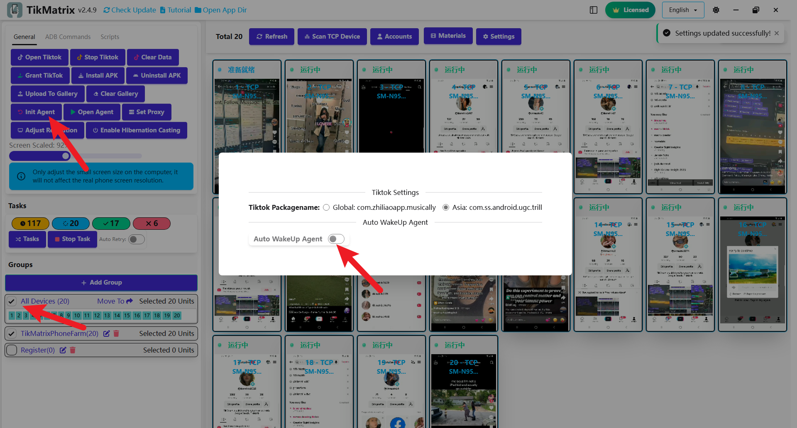

# Инициализация устройства

TikMatrix APK — это мобильный агент, необходимый для выполнения автоматизированных задач. Когда вы впервые подключаете телефон к компьютеру, TikMatrix автоматически устанавливает два APK файла: TikMatrix и TikMatrix Test (без интерфейса). Если ваш телефон запрашивает разрешение на установку, нажмите "Разрешить" (особенно на устройствах Xiaomi).

## Ручная установка/обновление

Для ручной установки или обновления TikMatrix APK отключите переключатель `Автоматическое пробуждение агента` в настройках. Затем выполните следующие шаги:

1. Выберите ваш телефон и нажмите `Общие` > `Инициализация агента`.
2. TikMatrix автоматически установит два APK файла на телефоне.
3. При запросе нажмите "Разрешить" для авторизации установки.
4. Если заблокировано защитой Google Play, нажмите "Все равно установить" для продолжения.
5. Дождитесь завершения установки (около 10 секунд).
6. Включите переключатель `Автоматическое пробуждение агента` для включения автоматического пробуждения приложения при подключении телефона.
7. Нажмите `Общие` > `Открыть агента` для тестирования установки. Если приложение не запускается, обратитесь в техническую поддержку.

## Скриншот

