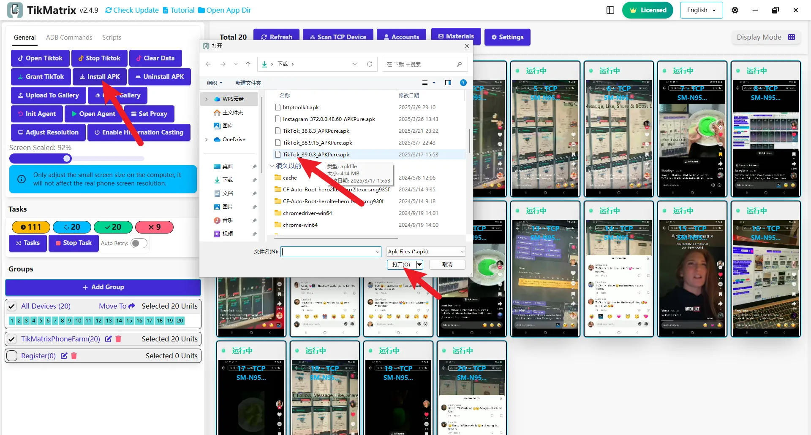

# Установка TikTok

Мы рекомендуем скачивать указанные ниже версии, так как более новые версии могут быть несовместимы. Программное обеспечение регулярно обновляется, и поддерживаемые версии будут объявлены в группе после обновления.

## Скачивание установочного пакета TikTok

* Международная версия: [com.zhiliaoapp.musically](https://apkpure.com/tiktok-musically-2024/com.zhiliaoapp.musically)
* Азиатская версия: [com.ss.android.ugc.trill](https://apkpure.com/tiktok/com.ss.android.ugc.trill)

## Шаги установки

1. Скачайте APK установочный пакет по ссылкам выше.
2. Выберите все устройства.
3. Нажмите `Общие` - `Установить APK` - выберите скачанный APK пакет.
4. Дождитесь завершения установки (каждое устройство может занять 1-3 минуты, в зависимости от модели телефона; пожалуйста, будьте терпеливы и не нажимайте кнопку "Установить APK" повторно).
5. После завершения установки нужно нажать кнопку `Настройки`, чтобы проверить, соответствует ли выбор версии TikTok установленной версии.
6. Нажмите кнопку `Открыть TikTok`, чтобы проверить, правильно ли установлено приложение TikTok.

## Скриншот

